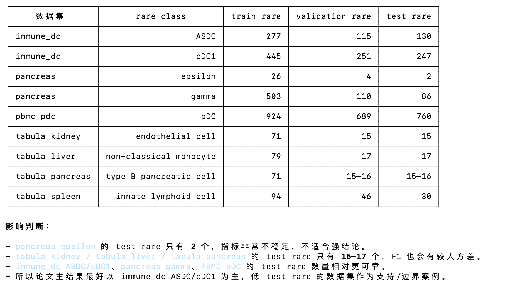

# scRareRefine

基于 scANVI latent embedding 的稀有细胞识别 post-hoc rescue 框架。

在已有 scANVI 输出的基础上，通过 prototype 距离 → gate → marker 验证三阶段 pipeline，修正 scANVI 在极小训练样本和 batch-heldout 场景下对稀有细胞类型的漏检问题。

**不替代** scANVI/CellTypist/Seurat label transfer，而是在其之后作为 refinement layer 使用。

---

## 核心结果

immune_dc cDC1，`rare_train_size=5`，3 seeds，batch-heldout split：

| 方法                            | rare-class F1            |
| ------------------------------- | ------------------------ |
| scANVI baseline                 | 0.003 ± 0.005           |
| kNN k=15                        | 0.000 ± 0.000           |
| **Gate+Marker（本方法）** | **0.986 ± 0.004** |

rescue 是否有效由 **separability ratio** 预测（训练集推断前可算）：

- `sep ≥ 1.3`：rescue 显著有效
- `sep < 1.1`：方法自动 abstain，不改变 baseline 输出

---

## 快速开始

### 前提

```bash
pip install scvi-tools anndata pandas numpy scipy scikit-learn matplotlib pyyaml psutil
```

### 主入口

已有 scANVI embeddings，直接跑主方法：

```bash
python src/main.py \
    --config configs/immune_dc.yaml \
    --seed 42 --rare_class ASDC --rare_train_size 20

# --force 强制重算 prototype scores 和 marker threshold
```

输出（仅 baseline vs scRareRefine）：

- `metrics/scRareRefine_metrics.csv`
- `metrics/scRareRefine_comparison.png`

控制台摘要：

```
method        rare_f1  rare_recall  rare_precision  overall_accuracy
baseline        0.003        0.002           0.500             0.985
scRareRefine    0.986        0.987           0.986             0.999

sep_ratio=1.408 [HIGH]  n_rescued=142  false_rescues=1
```

### 对比 baselines（可选，独立运行）

```bash
python src/03b_knn_baseline.py \
    --config configs/immune_dc.yaml --seed 42 --rare_train_size 20
# 输出：knn/test_metrics.csv（含 baseline 行 + knn 行）

python src/03c_celltypist_baseline.py \
    --config configs/immune_dc.yaml --seed 42 --rare_train_size 20
# 输出：celltypist/test_metrics.csv（含 baseline 行 + lr 行）
```

### 三个 seed 汇总 + 对比图

三个 seed 的 main / kNN / LR 都跑完后：

```bash
python src/07_evaluate.py \
    --config configs/immune_dc.yaml \
    --rare_class ASDC --rare_train_size 20 \
    --seeds 42 43 44
```

默认 `--seeds 42 43 44`，所以也可简写：

```bash
python src/07_evaluate.py \
    --config configs/immune_dc.yaml \
    --rare_class ASDC --rare_train_size 20
```

输出目录：`outputs/{dataset}/evaluate_{split_mode}_{rare_class}_rare{rare_train_size}/`

输出文件：

- `all_seeds_metrics.csv`：每行一个 `(method, seed)`
- `comparison_bar.png`：三个 seed 均值柱状图，误差线为 ±std
- `comparison_box.png`：三个 seed 箱线图 + 单个 seed 散点

对比方法固定为：`baseline`、`knn_k15`、`lr`、`scRareRefine`。

---

## 目录结构

```
src/
├── main.py                       # scRareRefine 主入口（baseline vs scRareRefine）
├── utils.py                      # 共享工具：IO、metrics、路径
├── 01_split.py                   # 生成 train/val/test split
├── 02_baseline_scanvi.py         # 训练 scANVI，输出 embeddings
├── 03_prototype.py               # prototype 距离得分 + separability ratio（被 main.py 调用）
├── 03b_knn_baseline.py           # kNN baseline（输出 baseline + knn）
├── 03c_celltypist_baseline.py    # LR baseline（输出 baseline + lr）
├── 05_prototype_gate_marker.py   # scRareRefine 核心逻辑（被 main.py 调用）
├── 06_fusion.py                  # fusion 扩展（可选，独立运行）
├── 07_evaluate.py                # 全方法汇总 + 可视化
├── 09_aggregate_plot.py          # 多数据集聚合图表
└── 10_paper_table.py             # 论文 LaTeX 表格生成
outputs/
└── {dataset}/{run_id}/
    ├── embeddings/               # 02 输出
    ├── prototype/                # 03 输出（separability.csv）
    ├── knn/                      # 03b 输出
    ├── celltypist/               # 03c 输出（LR）
    ├── gate_marker/              # 05 输出（main.py 写入）
    ├── fusion/                   # 06 输出（可选）
    └── metrics/                  # final_metrics.csv、图表
```

`run_id` 格式：`{split_mode}_seed{seed}_{rare_class}_rare{rare_train_size}`

---

## 完整流程

```bash
# 1. 生成 split（每个 seed 一次）
python src/01_split.py --config configs/immune_dc.yaml --seed 42

# 2. 训练 scANVI（已有 embedding 自动跳过；--force 强制重训）
python src/02_baseline_scanvi.py \
    --config configs/immune_dc.yaml --seed 42 --rare_train_size 20

# 3. 主方法
python src/main.py \
    --config configs/immune_dc.yaml --seed 42 --rare_train_size 20

# 4. （可选）对比 baselines
python src/03b_knn_baseline.py \
    --config configs/immune_dc.yaml --seed 42 --rare_train_size 20
python src/03c_celltypist_baseline.py \
    --config configs/immune_dc.yaml --seed 42 --rare_train_size 20

# 5. 三个 seed 汇总 + 出图
python src/07_evaluate.py \
    --config configs/immune_dc.yaml --rare_class ASDC --rare_train_size 20 \
    --seeds 42 43 44
```

---

## 方法说明

| 方法名                 | 脚本                | 说明                                               |
| ---------------------- | ------------------- | -------------------------------------------------- |
| baseline               | 02                  | scANVI softmax 原始输出                            |
| knn_k15                | 03b                 | scANVI latent 上 kNN（k=15）                       |
| lr                     | 03c                 | HVG expression 上 logistic regression              |
| **scRareRefine** | **main / 05** | **prototype rank-1 + marker 验证（主方法）** |
| fusion_gated           | 06                  | 概率融合扩展（可选）                               |

**sep_ratio**：诊断指标，反映稀有细胞在 latent space 中的可分性。`sep ≥ 1.3` 时 rescue 效果显著；`sep < 1.1` 时方法自动 abstain，不修改 baseline 输出。

---

## 核心 inductive 约束

所有 reference、threshold、signature 均来自 train/validation，不使用 test 标签：

1. val/test cell 不进入训练 reference
2. HVG 仅基于训练集选择
3. prototype reference 仅来自训练集标注 cell
4. marker signature 仅由训练集有标注 cell 计算
5. 所有调参（marker threshold、fusion 参数）仅基于 validation
6. test 标签不用于任何调参或阈值选择

---

## 数据规则

- `data/raw/` 只读，禁止修改
- 实验输出写入 `outputs/`
- 旧版代码备份在 `_legacy/`（不再使用）



