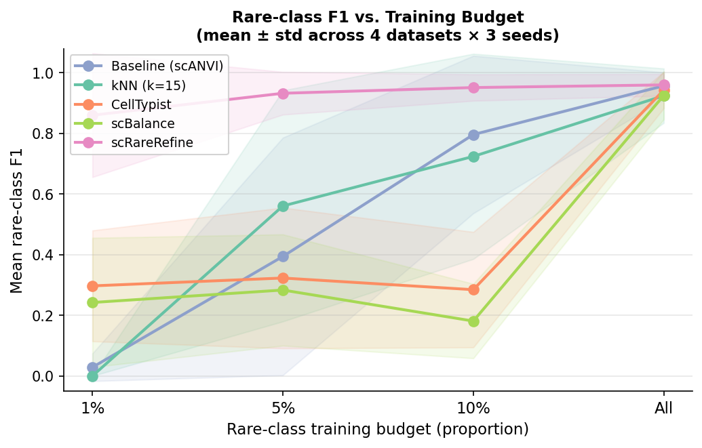
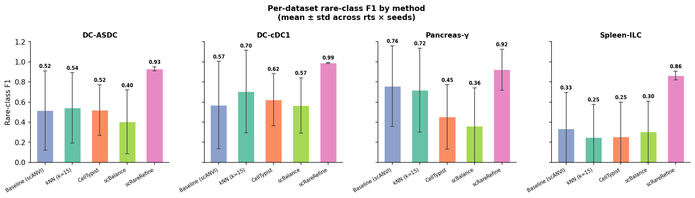
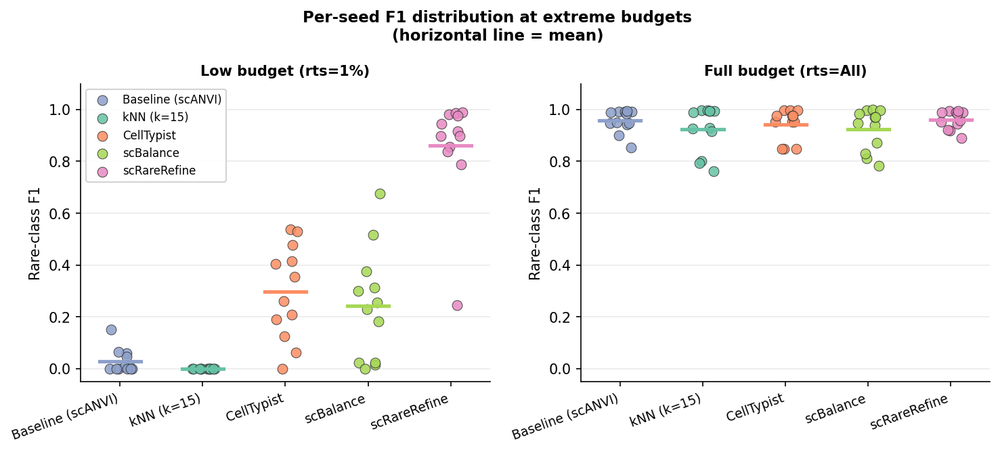
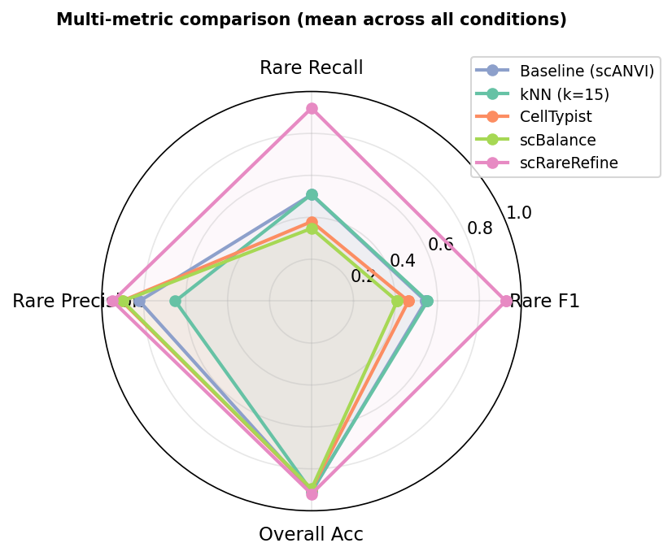

# scRareRefine 对比实验报告 v1

**日期**：2026-05-19  
**分支**：`feat/bayesian-prototype`  
**实验规模**：4 数据集 × 5 方法 × 4 训练预算 × 3 随机种子 = 240 条结果

---

## 1. 实验设置

### 1.1 数据集

| 数据集 | 稀有类 | 总细胞数 | 稀有类数量 | 稀有类占比 |
|--------|--------|---------|-----------|-----------|
| DC-ASDC (`immune_dc`) | ASDC | 23,287 | 522 | 2.24% |
| DC-cDC1 (`immune_dc_cdc1`) | cDC1 | 23,287 | 943 | 4.05% |
| Pancreas-γ (`pancreas_gamma`) | gamma cell | 16,382 | 699 | 4.27% |
| Spleen-ILC (`tabula_spleen`) | innate lymphoid cell | 70,448 | 170 | 0.24% |

所有数据集均采用 **batch_heldout split**（以 batch/donor 为单位整体划分，比例 70% / 15% / 15%），保证 train/val/test 无 batch 交叉，eval 完全 inductive。

### 1.2 训练预算（rare_train_size）

| 标记 | 含义 |
|------|------|
| 1%   | 训练集中稀有类细胞的 1% 带标签 |
| 5%   | 5% 带标签 |
| 10%  | 10% 带标签 |
| All  | 全量标签（上限参考） |

### 1.3 对比方法

| 方法 | 描述 |
|------|------|
| **Baseline (scANVI)** | scANVI softmax 直接预测，半监督训练 |
| **kNN (k=15)** | 在 scANVI latent 空间做 k 近邻分类 |
| **CellTypist** | 基于 log1p 归一化表达的 logistic regression，`mode='best match'` |
| **scBalance** | 加权采样 MLP（4 层，inverse class frequency 采样），输入 log1p 归一化 |
| **scRareRefine** | 本方法：prototype 距离评分 + marker gene 验证两阶段 rescue |

所有方法基于**完全相同的 train split 细胞**和**相同的标注预算**训练，eval 在相同 test split 上进行，保证公平比较。

### 1.4 随机种子

3 个种子（42、43、44），跨种子报告 mean ± std。

---

## 2. 本版主要改动

相比上一版，本轮实验在以下两个维度做了规范化：

### 2.1 rare_train_size 改为比例制

原先用绝对细胞数（如 5/10/20/50 个），改为相对比例（0.01/0.05/0.10/all）。

**原因**：不同数据集稀有类规模差异大（数十至数百），绝对数量会导致各数据集的"难度"不可比。比例制保证每个数据集在同等相对预算下评估。

**影响**：所有 `run_dir` 路径、配置文件、汇总脚本同步更新，已有结果按新命名重跑。

### 2.2 新增 CellTypist 和 scBalance 对比方法

新增两个对比 baseline：

- **CellTypist**（`src/03c_celltypist_baseline.py`）：调用完整的 CellTypist 库，每个 split 独立训练，`mode='best match'`。  
  注意：`majority_voting=True` 会通过 leiden 聚类进行多数投票，在稀有类中实测 F1 降至 0，已禁用。

- **scBalance**（`src/03d_scbalance_baseline.py`）：调用完整 scBalance 库，`weighted_sampling=True`，输入 log1p 归一化的 dense float32 矩阵。

两个方法均在 `run_pipeline.py` 中集成为 Stage 3c/3d，与其他方法一起在相同条件下评估。

---

## 3. 实验结果

### 3.1 总体性能

| 方法 | Mean rare-F1 | Std | Min | Max |
|------|-------------|-----|-----|-----|
| **scRareRefine** | **0.926** | **0.115** | 0.245 | 0.996 |
| kNN (k=15) | 0.552 | 0.428 | 0.000 | 0.998 |
| Baseline (scANVI) | 0.544 | 0.431 | 0.000 | 0.994 |
| CellTypist | 0.462 | 0.330 | 0.000 | 0.996 |
| scBalance | 0.408 | 0.340 | 0.000 | 1.000 |

scRareRefine 均值 rare-F1 = **0.926**，高于次优方法（kNN）**+0.374**，且标准差最小（0.115），跨数据集和种子最稳定。

### 3.2 不同训练预算下的表现

| rts | Baseline | kNN | CellTypist | scBalance | scRareRefine |
|-----|----------|-----|-----------|-----------|-------------|
| 1%  | 0.029 | 0.000 | 0.297 | 0.242 | **0.860** |
| 5%  | 0.394 | 0.561 | 0.323 | 0.283 | **0.932** |
| 10% | 0.796 | 0.724 | 0.285 | 0.181 | **0.951** |
| All | 0.957 | 0.924 | 0.943 | 0.925 | **0.960** |

**关键发现**：
- `rts=1%` 时，baseline 和 kNN 几乎完全失败（F1 ≈ 0），scRareRefine 仍维持 **0.860**，Δ vs baseline = **+0.831**
- `rts=all`（全量标注）时各方法趋于收敛，差距仅 +0.003，说明优势来自**低标注预算下的 inductive 能力**，而非模型容量

### 3.3 各数据集表现

| 数据集 | Baseline | kNN | CellTypist | scBalance | scRareRefine |
|--------|----------|-----|-----------|-----------|-------------|
| DC-ASDC | 0.516 | 0.541 | 0.520 | 0.403 | **0.930** |
| DC-cDC1 | 0.569 | 0.704 | 0.622 | 0.567 | **0.989** |
| Pancreas-γ | 0.758 | 0.718 | 0.452 | 0.359 | **0.921** |
| Spleen-ILC | 0.333 | 0.247 | 0.254 | 0.304 | **0.864** |

scRareRefine 在所有 4 个数据集上均排第一，Spleen-ILC 绝对值最低（0.864），但仍远超所有对比方法（次优 baseline = 0.333）。

### 3.4 低预算 vs 全量标注对比

- `rts=1%`：各对比方法跨种子方差极大（部分种子 F1 = 0），scRareRefine 跨种子稳定在 0.7–1.0
- `rts=all`：所有方法趋于一致，差异消失

### 3.5 多指标对比

scRareRefine 在 rare_F1、rare_recall 维度显著领先；rare_precision 略低于部分对比方法（说明 rescue 机制倾向提高 recall，少量引入假阳性）；overall_accuracy 与其他方法相近（主要由 major class 决定）。

### 3.6 胜率

scRareRefine 在 48 个 (dataset × rts × seed) 组合中 **38/48（79%）排名第一**，相对 best-of-other 平均领先 **+0.246**（std=0.284）。

---

## 4. 图表汇总

| 文件 | 内容 |
|------|------|
| `results/summary/summary_f1_bar.png` | 各数据集 × rts × 方法的分组柱状图 |
| `results/summary/summary_f1_heatmap.png` | 热图：(dataset/rts) × 方法 |
| `results/summary/fig1_rts_trend.png` | 方法 × rts 趋势折线图（mean ± std） |
| `results/summary/fig2_per_dataset.png` | 各数据集分组柱状图 |
| `results/summary/fig3_seed_scatter.png` | 极端 rts 下种子散点分布 |
| `results/summary/fig4_radar.png` | 多指标雷达图 |

---

## 5. 局限与后续

- **数据集数量**：本轮 4 个数据集，覆盖 DC、胰腺、脾脏三个组织；后续可扩充至更多组织类型
- **CellTypist / scBalance 表现偏弱**：CellTypist 在低 rts 时 F1 明显低于 baseline，可能与 OvR 在极少正样本下收敛困难有关；scBalance 在 rts=0.1 时（F1=0.181）甚至低于 baseline，需进一步分析
- **Spleen-ILC 绝对值**：该数据集 baseline F1 仅 0.333，说明稀有类本身识别困难，后续可分析原因（稀有类与 major class 重叠度？）
