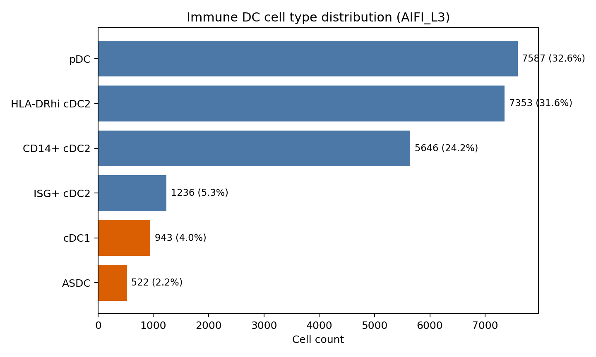
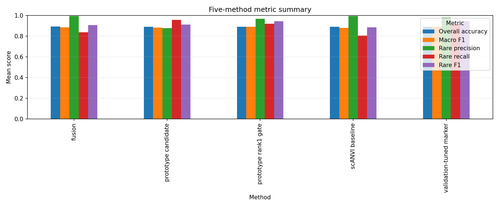
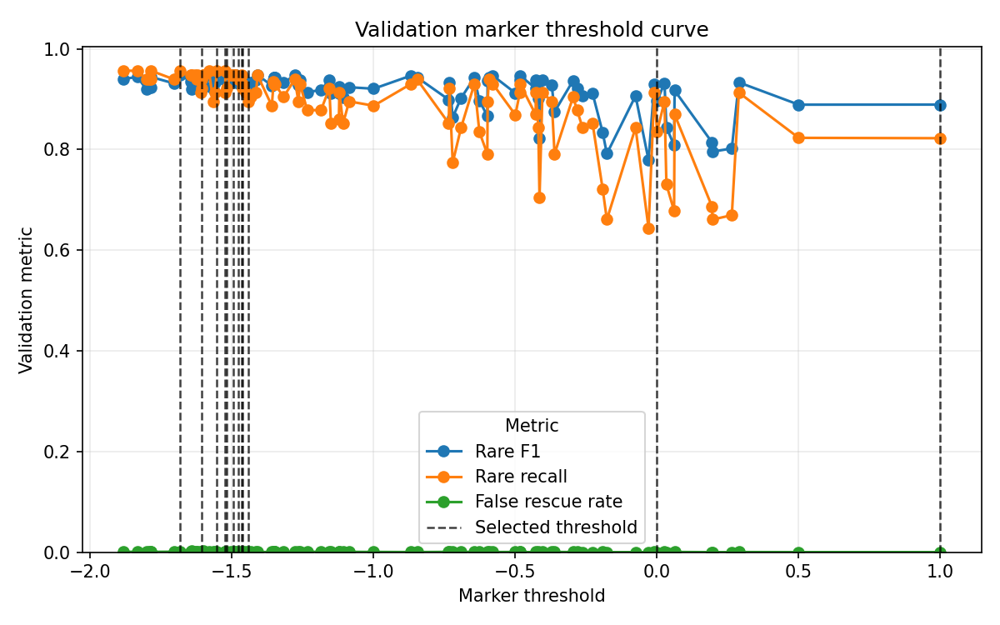
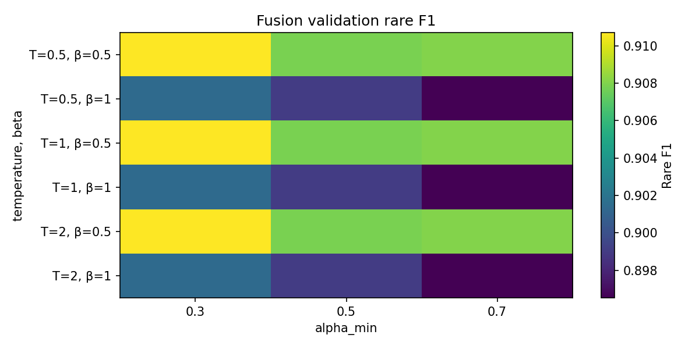
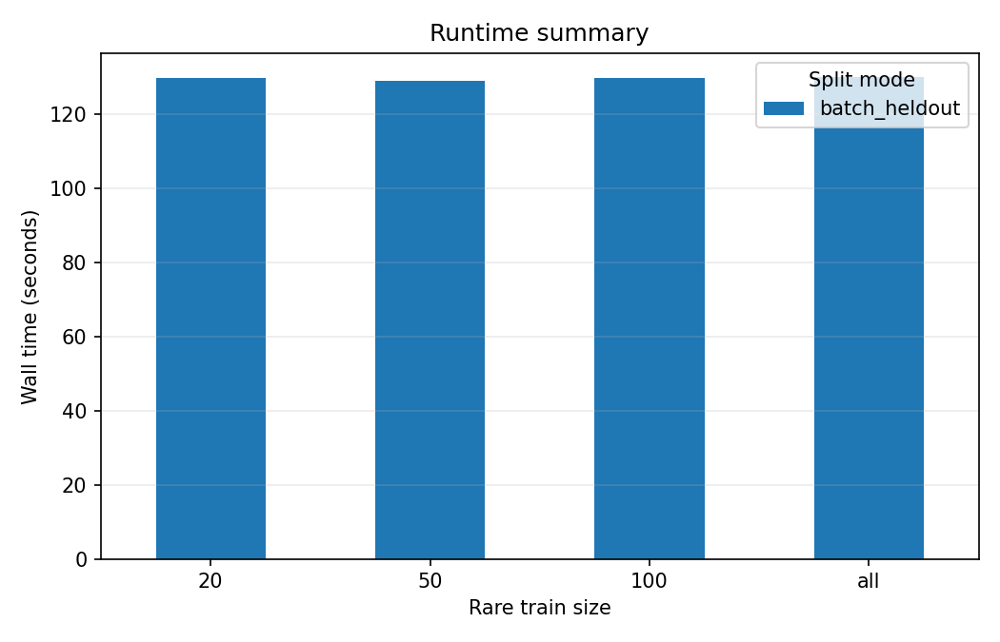
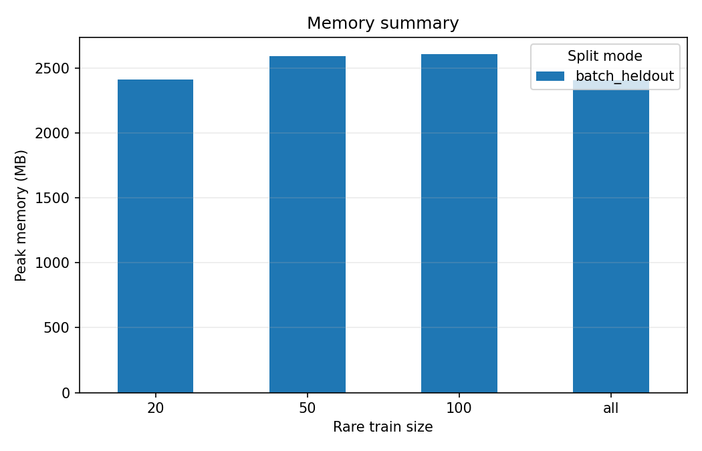

# immune_dc / ASDC inductive validation 实验报告

日期：2026-05-07
结果目录：[outputs/immune_dc/inductive_batch/asdc/](../../outputs/immune_dc/inductive_batch/asdc/)
报告图目录：[docs/reports/figures/](figures/)
结果版本：基于当前 stage-level CSV 重新复核；包含 12 个 runs（3 seeds × 4 rare-label budgets）和 5 个方法。

## 1. 实验目的

本实验评估 scRareRefine 在 inductive rare-cell annotation 场景下，对 ASDC 这一稀有类的识别能力是否优于纯 scANVI baseline。核心问题是：当训练集中 ASDC 标注预算较少时，prototype rescue、validation-tuned marker verification 和 probability fusion 是否能提升 held-out test 上的 rare-class F1，同时控制 major-to-rare false rescue。

## 2. 数据与设置

- 数据集：`immune_dc`
- 稀有类：`ASDC`
- split：`batch_heldout`
- seeds：42、43、44
- rare-label budget：20、50、100、all
- 训练/验证/测试约束：scVI/scANVI、HVG、prototype reference 和 marker signature 均不使用 test label；validation 仅用于 marker threshold 或 fusion 参数选择。

### 2.1 类别分布

| label         | n_cells | fraction | rare_candidate |
| ------------- | ------- | -------- | -------------- |
| ASDC          | 522     | 2.24%    | yes            |
| cDC1          | 943     | 4.05%    | yes            |
| ISG+ cDC2     | 1236    | 5.31%    | no             |
| CD14+ cDC2    | 5646    | 24.25%   | no             |
| HLA-DRhi cDC2 | 7353    | 31.58%   | no             |
| pDC           | 7587    | 32.58%   | no             |

## 3. 比较方法

1. **scANVI baseline**：只使用 inductive train set 训练 scANVI，在 validation/test query cells 上推断。
2. **prototype candidate**：使用 labeled train latent prototypes 直接产生 rare rescue candidates，不加 rank1/marker 过滤。
3. **prototype rank1 gate**：只保留 prototype rank1 指向 rare class 的候选。
4. **validation-tuned marker**：在 validation 上选择 marker-margin threshold，并应用到 test。
5. **fusion**：在 validation 上调参，将 scANVI probability 与 prototype probability 融合后应用到 test。

## 4. 主要结果

本次复核读取了 [five_method_effect_summary.csv](../../outputs/immune_dc/inductive_batch/asdc/stages/inductive_methods/five_method_effect_summary.csv)、[five_method_effect_runs.csv](../../outputs/immune_dc/inductive_batch/asdc/stages/inductive_methods/five_method_effect_runs.csv)、[selected_marker_thresholds.csv](../../outputs/immune_dc/inductive_batch/asdc/stages/inductive_methods/selected_marker_thresholds.csv) 和 [resource_summary.csv](../../outputs/immune_dc/inductive_batch/asdc/stages/inductive_methods/resource_summary.csv)。当前 CSV 与报告主体结论一致：20/50/100 low-label budgets 下 validation-tuned marker 最优，`all` 条件下 fusion 略优。

### 4.1 汇总图

### 4.2 核心指标表：mean ± std over 3 seeds

`Δrare_F1` 表示相对同一 rare_train_size 下 scANVI baseline 的 absolute improvement。

| rare_train_size | method                  | rare_F1             | Δrare_F1 | rare_recall    | rare_precision | macro_F1       | false_rescue_rate |
| --------------- | ----------------------- | ------------------- | --------- | -------------- | -------------- | -------------- | ----------------- |
| 20              | fusion                  | 0.834 ± 0.014      | +0.059    | 0.715 ± 0.020 | 1.000 ± 0.000 | 0.871 ± 0.011 | 0.0000 ± 0.0000  |
| 20              | prototype rank1 gate    | 0.939 ± 0.014      | +0.164    | 0.905 ± 0.012 | 0.975 ± 0.022 | 0.886 ± 0.015 | 0.0005 ± 0.0004  |
| 20              | scANVI baseline         | 0.775 ± 0.018      | +0.000    | 0.633 ± 0.025 | 1.000 ± 0.000 | 0.857 ± 0.015 | 0.0000 ± 0.0000  |
| 20              | validation-tuned marker | **0.942 ± 0.006** | +0.167    | 0.903 ± 0.012 | 0.986 ± 0.013 | 0.886 ± 0.013 | 0.0003 ± 0.0003  |
| 50              | fusion                  | 0.911 ± 0.007      | +0.012    | 0.838 ± 0.008 | 0.997 ± 0.005 | 0.883 ± 0.006 | 0.0000 ± 0.0000  |
| 50              | prototype rank1 gate    | 0.941 ± 0.006      | +0.043    | 0.921 ± 0.004 | 0.963 ± 0.016 | 0.886 ± 0.006 | 0.0007 ± 0.0003  |
| 50              | scANVI baseline         | 0.899 ± 0.009      | +0.000    | 0.818 ± 0.016 | 0.997 ± 0.005 | 0.879 ± 0.008 | 0.0000 ± 0.0000  |
| 50              | validation-tuned marker | **0.947 ± 0.006** | +0.049    | 0.921 ± 0.004 | 0.976 ± 0.014 | 0.887 ± 0.007 | 0.0004 ± 0.0002  |
| 100             | fusion                  | 0.933 ± 0.007      | +0.010    | 0.879 ± 0.012 | 0.994 ± 0.005 | 0.898 ± 0.005 | 0.0000 ± 0.0000  |
| 100             | prototype rank1 gate    | 0.942 ± 0.002      | +0.019    | 0.923 ± 0.000 | 0.963 ± 0.004 | 0.899 ± 0.005 | 0.0007 ± 0.0002  |
| 100             | scANVI baseline         | 0.923 ± 0.014      | +0.000    | 0.862 ± 0.028 | 0.994 ± 0.005 | 0.896 ± 0.004 | 0.0000 ± 0.0000  |
| 100             | validation-tuned marker | **0.946 ± 0.002** | +0.023    | 0.923 ± 0.000 | 0.970 ± 0.005 | 0.900 ± 0.005 | 0.0005 ± 0.0002  |
| all             | fusion                  | **0.951 ± 0.009** | +0.006    | 0.921 ± 0.012 | 0.984 ± 0.008 | 0.890 ± 0.007 | 0.0001 ± 0.0002  |
| all             | prototype rank1 gate    | 0.950 ± 0.009      | +0.005    | 0.933 ± 0.012 | 0.968 ± 0.008 | 0.888 ± 0.007 | 0.0003 ± 0.0003  |
| all             | scANVI baseline         | 0.945 ± 0.005      | +0.000    | 0.910 ± 0.016 | 0.984 ± 0.008 | 0.887 ± 0.008 | 0.0000 ± 0.0000  |
| all             | validation-tuned marker | 0.944 ± 0.005      | -0.001    | 0.913 ± 0.018 | 0.978 ± 0.012 | 0.887 ± 0.008 | 0.0001 ± 0.0002  |

### 4.3 最优方法按标注预算分组

| rare_train_size | best_method             | rare_F1 | Δrare_F1 | rare_recall | rare_precision | false_rescue_rate |
| --------------- | ----------------------- | ------- | --------- | ----------- | -------------- | ----------------- |
| 20              | validation-tuned marker | 0.942   | +0.167    | 0.903       | 0.986          | 0.0003            |
| 50              | validation-tuned marker | 0.947   | +0.049    | 0.921       | 0.976          | 0.0004            |
| 100             | validation-tuned marker | 0.946   | +0.023    | 0.923       | 0.970          | 0.0005            |
| all             | fusion                  | 0.951   | +0.006    | 0.921       | 0.984          | 0.0001            |

## 5. 原始聚合数据表

下表保留所有 5 个方法的均值，用于检查 candidate/gate/marker/fusion 的完整变化链路。

| rare_train_size | method                  | accuracy | macro_F1 | rare_precision | rare_recall | rare_F1 | Δrare_F1 | candidates | marker_verified | false_rescues |
| --------------- | ----------------------- | -------- | -------- | -------------- | ----------- | ------- | --------- | ---------- | --------------- | ------------- |
| 20              | fusion                  | 0.8897   | 0.8712   | 1.0000         | 0.7154      | 0.8340  | +0.0586   |            |                 | 0.0           |
| 20              | prototype candidate     | 0.8879   | 0.8819   | 0.9323         | 0.9077      | 0.9186  | +0.1432   | 44.7       | 0.0             | 9.0           |
| 20              | prototype rank1 gate    | 0.8888   | 0.8856   | 0.9754         | 0.9051      | 0.9389  | +0.1636   | 38.3       |                 | 3.0           |
| 20              | scANVI baseline         | 0.8835   | 0.8571   | 1.0000         | 0.6333      | 0.7753  | +0.0000   | 0.0        | 0.0             | 0.0           |
| 20              | validation-tuned marker | 0.8890   | 0.8862   | 0.9862         | 0.9026      | 0.9424  | +0.1671   | 38.3       | 36.7            | 1.7           |
| 50              | fusion                  | 0.8915   | 0.8831   | 0.9969         | 0.8385      | 0.9109  | +0.0123   |            |                 | 0.0           |
| 50              | prototype candidate     | 0.8892   | 0.8827   | 0.8853         | 0.9692      | 0.9247  | +0.0261   | 36.0       | 0.0             | 16.3          |
| 50              | prototype rank1 gate    | 0.8901   | 0.8860   | 0.9627         | 0.9205      | 0.9411  | +0.0425   | 17.7       |                 | 4.3           |
| 50              | scANVI baseline         | 0.8887   | 0.8786   | 0.9969         | 0.8179      | 0.8985  | +0.0000   | 0.0        | 0.0             | 0.0           |
| 50              | validation-tuned marker | 0.8904   | 0.8871   | 0.9757         | 0.9205      | 0.9473  | +0.0487   | 17.7       | 16.0            | 2.7           |
| 100             | fusion                  | 0.9002   | 0.8984   | 0.9942         | 0.8795      | 0.9333  | +0.0104   |            |                 | 0.0           |
| 100             | prototype candidate     | 0.8979   | 0.8932   | 0.8626         | 0.9692      | 0.9116  | -0.0113   | 34.0       | 0.0             | 20.0          |
| 100             | prototype rank1 gate    | 0.8995   | 0.8989   | 0.9626         | 0.9231      | 0.9424  | +0.0195   | 12.0       |                 | 4.0           |
| 100             | scANVI baseline         | 0.8989   | 0.8955   | 0.9942         | 0.8615      | 0.9229  | +0.0000   | 0.0        | 0.0             | 0.0           |
| 100             | validation-tuned marker | 0.8997   | 0.8996   | 0.9704         | 0.9231      | 0.9461  | +0.0232   | 12.0       | 11.0            | 3.0           |
| all             | fusion                  | 0.8906   | 0.8901   | 0.9836         | 0.9205      | 0.9510  | +0.0056   |            |                 | 0.7           |
| all             | prototype candidate     | 0.8853   | 0.8776   | 0.8256         | 0.9795      | 0.8958  | -0.0496   | 34.0       | 0.0             | 25.0          |
| all             | prototype rank1 gate    | 0.8881   | 0.8877   | 0.9681         | 0.9333      | 0.9504  | +0.0050   | 5.0        |                 | 2.0           |
| all             | scANVI baseline         | 0.8879   | 0.8868   | 0.9835         | 0.9103      | 0.9454  | +0.0000   | 0.0        | 0.0             | 0.0           |
| all             | validation-tuned marker | 0.8878   | 0.8866   | 0.9783         | 0.9128      | 0.9443  | -0.0011   | 5.0        | 1.0             | 0.7           |

## 6. Marker threshold 与 fusion 参数行为

### 6.1 Marker threshold curve

### 6.2 选中阈值

| rare_train_size | runs | selected_marker_threshold |
| --------------- | ---- | ------------------------- |
| 20              | 3    | -1.504 ± 0.090           |
| 50              | 3    | -1.487 ± 0.027           |
| 100             | 3    | -1.524 ± 0.028           |
| all             | 3    | -0.228 ± 1.356           |

20/50/100 三个 low-label 设置的 marker threshold 较稳定，均约为 -1.5。`all` 的阈值标准差显著变大，说明 full-label 下 remaining rare errors 更少，validation threshold selection 对少量样本和 seed 更敏感。

### 6.3 Fusion validation heatmap

Fusion 的主要优势是保守：多数预算下 false rescue rate 约为 0，但 rare recall 提升低于 prototype/marker 路线。它适合作为高精度、低扰动的安全后处理；在低标注预算下，若目标是最大化 ASDC recall/F1，validation-tuned marker 更优。

## 7. 资源使用

| rare_train_size | runs | wall_time_s    | peak_memory_mb  |
| --------------- | ---- | -------------- | --------------- |
| 20              | 3    | 129.7 ± 220.6 | 2413.0 ± 542.2 |
| 50              | 3    | 128.9 ± 219.6 | 2593.8 ± 272.0 |
| 100             | 3    | 129.6 ± 220.9 | 2606.7 ± 656.3 |
| all             | 3    | 129.8 ± 221.4 | 2409.0 ± 121.3 |

资源统计需要谨慎解释：当前结果中 seed 42/43 的 wall time 约 2 秒，而 seed 44 约 382–386 秒，说明部分 run 复用了已有 baseline artifacts，只重建了后处理或 stage outputs。因此 wall-time 均值/标准差混合了 cached run 和 full run，不能作为训练时间结论；peak memory 可作为粗略上限参考，约 2.1–3.3 GB。

## 8. 关键发现

### 发现 1：低标注预算下，validation-tuned marker 显著提升 rare F1

- **Observation**：rare_train_size=20 时，scANVI baseline rare F1 为 0.775 ± 0.018，validation-tuned marker 提升到 0.942 ± 0.006，absolute gain 为 +0.167；rare recall 从 0.633 ± 0.025 提升到 0.903 ± 0.012。
- **Interpretation**：scANVI baseline 在低 ASDC 标注预算下非常保守，precision 达到 1.000 但 recall 不足；prototype + marker verification 能救回大量 rare false negatives。
- **Implication**：scRareRefine 的最大价值场景是 rare-label scarce setting，特别是 rare class 已有少量可靠 marker/prototype signal 但 deep classifier 不敢预测 rare 的场景。
- **Next step**：在 cDC1、pancreas gamma/epsilon 上重复 low-label budget sweep，确认该增益是否跨 rare class 稳定。

### 发现 2：prototype candidate recall 很高，但必须加 gate/marker 控制 false rescue

- **Observation**：prototype candidate 在 rare_train_size=100 时 rare recall 达到 0.969，但 false rescues 平均 20.0，rare F1 反而比 baseline 低 0.011；在 `all` 条件下 false rescues 平均 25.0，rare F1 比 baseline 低 0.050。
- **Interpretation**：裸 prototype candidate 会过度 relabel major cells，尤其当 baseline 已经较强时，额外 rescue 的 marginal benefit 小于 false positive 代价。
- **Implication**：prototype candidate 更适合作为候选生成器，而不是最终分类器；rank1 gate 和 marker verification 是必要的安全层。
- **Next step**：分析 false rescue 的来源类别，判断是否集中在 cDC2/pDC 等与 ASDC transcriptome 接近的 major class。

### 发现 3：marker verification 在 20/50/100 budget 下是最优策略，但 full-label 下收益消失

- **Observation**：validation-tuned marker 在 20/50/100 三个预算下分别取得 best rare F1：0.942、0.947、0.946；但在 `all` 条件下 rare F1 为 0.944，比 baseline 低 0.001。
- **Interpretation**：当 ASDC 标注足够多时，scANVI baseline 已经达到 rare F1 0.945，后处理可救回的 rare errors 很少；marker threshold 的选择开始受 validation 小样本波动影响。
- **Implication**：scRareRefine 不应被定位为 full-label classifier replacement，而应定位为 low-label rare-class refinement module。
- **Next step**：在配置中允许按 validation gain 自动选择是否启用 marker refinement；如果 validation 不显示正增益，则保留 baseline 或 fusion。

### 发现 4：fusion 更保守，适合作为低 false-rescue 的安全备选

- **Observation**：fusion 在 20/50/100/all 下 rare F1 分别相对 baseline 提升 +0.059、+0.012、+0.010、+0.006，并且 false rescue rate 几乎为 0。
- **Interpretation**：fusion 更像 probability calibration，而非强制 rescue；它避免 major-to-rare damage，但对 low-budget recall 的提升不如 prototype/marker。
- **Implication**：如果应用场景对 false positive 极度敏感，fusion 是安全默认值；如果目标是 rare discovery，marker-refined prototype route 更合适。
- **Next step**：比较 fusion 与 marker route 的 validation selection rule：按 rare F1、按 false rescue constraint、或按 application-specific utility 选择最终方法。

## 9. 结论

当前 ASDC batch-heldout 实验支持以下结论：scRareRefine 在 rare-label scarce 的 inductive setting 下能显著提升 ASDC rare F1，主要增益来自 prototype rescue 加 validation-tuned marker verification。最佳结果出现在 low-label budgets：20 labels 时 rare F1 从 0.775 提升到 0.942，50 labels 时从 0.899 提升到 0.947，100 labels 时从 0.923 提升到 0.946。随着 rare labels 增加到 100/all，baseline 变强，后处理收益递减；full-label 条件下 fusion 以 0.951 rare F1 略优于 baseline 的 0.945，但增益很小，应优先使用 validation gate 决定是否启用后处理。

## 10. 建议下一步实验

1. **跨 rare class 复现**：在 cDC1、pancreas gamma、pancreas epsilon 上运行同样的 20/50/100/all sweep。
2. **false rescue 分解**：输出 false rescue 的 true label 分布和 marker score 分布，定位最容易被误救的 major class。
3. **自动方法选择**：在 validation 上比较 baseline、fusion、rank1 gate、marker route，并只在 validation rare F1 增益超过阈值且 false rescue constraint 满足时启用 refinement。
4. **资源重新基准测试**：清理或隔离 cached artifacts 后，重新跑 full training 版本，单独报告 MPS/CPU 下 wall time 和 memory。
5. **统计显著性检验**：增加 seeds 到 ≥5，并对 baseline vs marker rare F1 做 paired test 或 bootstrap confidence interval。
