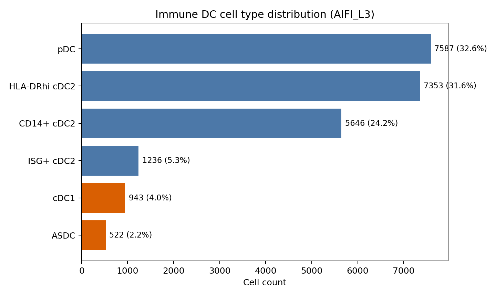
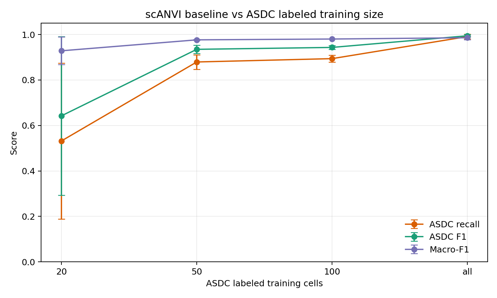
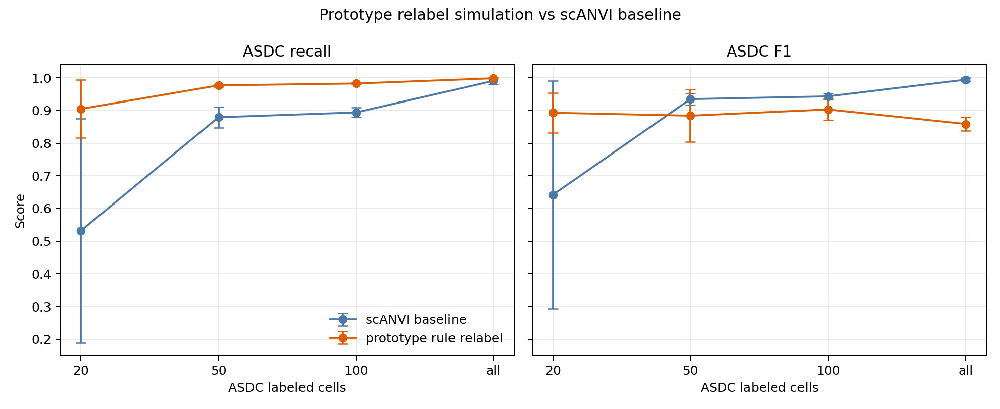
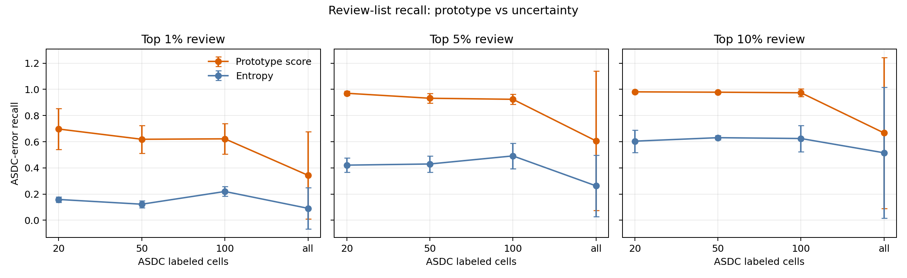
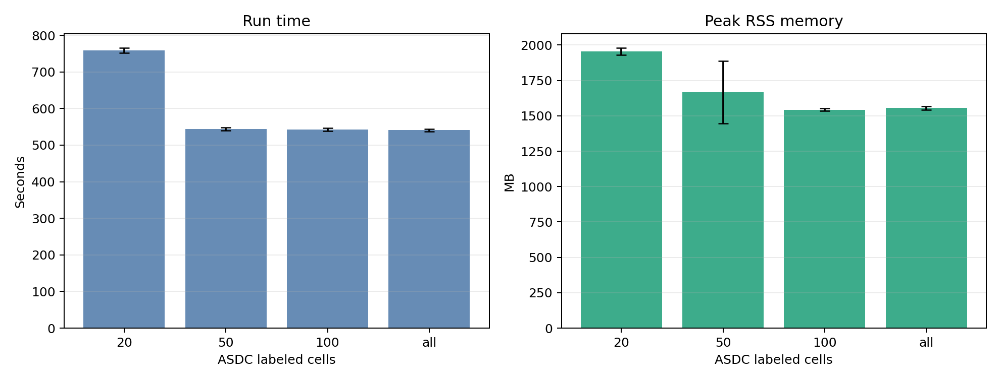
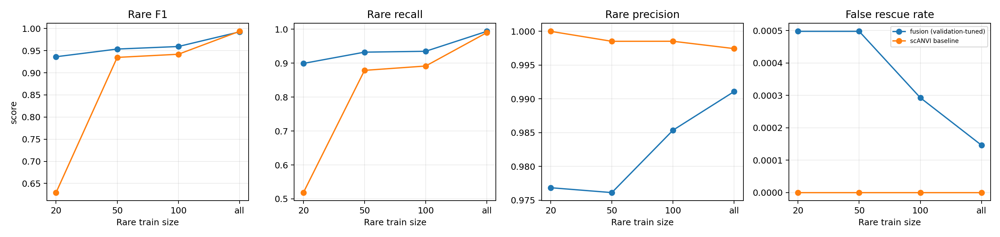

# scRareRefine P0 分析报告：Immune DC / ASDC rare known annotation

## 1. 背景与目标

本阶段围绕`human_immune_health_atlas_dc.h5ad` 做 P0 验证，目标不是发现未知细胞，而是验证：

> 已知稀有类 ASDC 在训练集中只保留少量标注时，scANVI 是否会把它吞并到邻近大类；以及scANVI 输出的latent embedding / uncertainty 是否足以支持 rare-aware refinement。

当前实验对应研究方案中的两个模块：

- **M2 Prototype-distance Rescue**：在 scANVI latent space 中，用训练集中已标注细胞建立各类 prototype，检查被错分细胞是否更接近ASDC prototype；- **M5 Uncertainty Gate / Selective Refinement**：用 entropy / margin 等不确定性指标给高风险细胞排序。

当前还没有实现或验证：

- M1 balanced latent classifier

- M3 local-density / neighbor-purity

- M4 marker-consistency verifier

- M6 latent oversampling

因此，本报告中的“加模块后”主要指 **scANVI 后处理阶段的 prototype rule / review ranking**，不是重新训练了一个新 backbone。

## 2. 数据集当前况

数据集：`data/human_immune_health/human_immune_health_atlas_dc.h5ad`

配置：

- 标签列：`AIFI_L3`

- batch 列：`batch_id`

- 训练矩阵：`raw.X`

- 总细胞数：`23,287`

- 细胞类型数：`6`

- batch 数：`36`

以 `<5%` 定义，`ASDC` —`cDC1` —rare candidates。本阶段主攻 `ASDC`。



| Cell type     | Count | Fraction |
| ------------- | ----: | -------: |
| pDC           | 7,587 |   32.58% |
| HLA-DRhi cDC2 | 7,353 |   31.58% |
| CD14+ cDC2    | 5,646 |   24.25% |
| ISG+ cDC2     | 1,236 |    5.31% |
| cDC1          |   943 |    4.05% |
| ASDC          |   522 |    2.24% |

## 3. 实验设置

个 ASDC —controlled downsampling—

| Setting       | ASDC labeled training cells | Seeds      |
| ------------- | --------------------------: | ---------- |
| extreme rare  |                          20 | 42, 43, 44 |
| rare          |                          50 | 42, 43, 44 |
| moderate rare |                         100 | 42, 43, 44 |
| full label    |                         all | 42, 43, 44 |

scANVI 设置：

- HVG：3,000 genes

- latent dim：30

- scVI epochs：00

- scANVI epochs：00

- unlabeled category：`Unknown`

注意：未标注 ASDC 的真实标签只用于最终评估，不进—`scanvi_label` 训练列。

## 4. 不做后处理时：scANVI baseline

scANVI 在整体指标上表现很高，但 ASDC recall 会随训练标注数量明显变化。`20` 个 ASDC label —seed 方差较大，说明极少样本下 baseline 不稳定。



| ASDC train size | ASDC recall mean | ASDC F1 mean | Macro-F1 mean |
| :-------------: | :--------------: | :----------: | :-----------: |
|       20       |      0.532      |    0.642    |     0.929     |
|       50       |      0.879      |    0.935    |     0.977     |
|       100       |      0.894      |    0.943    |     0.980     |
|       all       |      0.991      |    0.995    |     0.986     |

最典型的failure 来自 `seed=42, ASDC_train_size=20`：

| Metric           |  Value |
| ---------------- | -----: |
| overall accuracy | 0.9699 |
| macro-F1         | 0.8586 |
| ASDC precision   | 1.0000 |
| ASDC recall      | 0.1360 |
| ASDC F1          | 0.2395 |

—run 个 ASDC 错分去向：

| Misclassified as | Count |
| ---------------- | ----: |
| HLA-DRhi cDC2    |   270 |
| pDC              |   176 |
| ISG+ cDC2        |     4 |
| cDC1             |     1 |

这说明scANVI 的问题不是随机噪声，而是符合研究假设的**rare-to-neighbor-major absorption**：ASDC 被邻—DC 大类吞并。

## 5. 基于 scANVI 做了什么改为

当前没有对 scANVI 内部 loss，也没有替换 backbone。我们做的是 **post-hoc rare-aware refinement / review**—

1. 训练标准 scVI/scANVI—2. 提取每个细胞的：

   - latent embedding

   - predicted label

   - prediction probability

   - entropy

   - margin

3. 用训练集中有标签细胞，在 latent space 中建立每—cell type 用 prototype；4. 对每个细胞计算：

   - 个 ASDC prototype 的距离   - 到预测类 prototype 的距离   - ASDC prototype rank

   - `d_pred - d_ASDC`

5. 用 prototype score 生成 review list；并模拟一个简—rescue rule：

```text

pred != ASDC

and prototype_rank_ASDC <= 2

and margin <= 25% quantile

=> relabel as ASDC

```

这个 rule 当前只是验证 M2 是否有效，不是最终模型。最终版本仍应加—M4 marker verifier 来控制false positive。

## 6. 用 prototype 后处理后的效果

### 6.1 Direct relabel simulation

prototype rule 在极—label 场景下能明显提升 ASDC recall / F1；但个 ASDC label 已经充足时，baseline 本身已经很强，直—relabel 会引—false positive。



| ASDC train size | Method                 | Accuracy mean | Macro-F1 mean | ASDC precision mean | ASDC recall mean | ASDC F1 mean |
| --------------- | ---------------------- | ------------: | ------------: | ------------------: | ---------------: | -----------: |
| 20              | scANVI baseline        |        0.9789 |        0.9285 |              1.0000 |           0.5319 |       0.6424 |
| 20              | prototype rule relabel |        0.9846 |        0.9717 |              0.8826 |           0.9049 |       0.8930 |
| 50              | scANVI baseline        |        0.9832 |        0.9767 |              0.9986 |           0.8793 |       0.9349 |
| 50              | prototype rule relabel |        0.9799 |        0.9673 |              0.8144 |           0.9770 |       0.8842 |
| 100             | scANVI baseline        |        0.9866 |        0.9803 |              0.9986 |           0.8940 |       0.9434 |
| 100             | prototype rule relabel |        0.9843 |        0.9729 |              0.8369 |           0.9828 |       0.9032 |
| all             | scANVI baseline        |        0.9848 |        0.9859 |              0.9981 |           0.9911 |       0.9945 |
| all             | prototype rule relabel |        0.9776 |        0.9613 |              0.7535 |           0.9987 |       0.8587 |

结论：

- —`20` 个 ASDC label 时，prototype relabel —`ASDC F1=0.642` 提升到`0.893`—- —`50/100/all` 时，prototype rule 虽然继续提高 recall，但 precision 明显下降，F1 反而不一定提升到- 因此 prototype 更适合作为 **selective rescue / review signal**，而不是无条件全自动改标签。

### 6.2 Review-list 效果

作为 review ranking，prototype 明显强于 entropy：



Top-5% review recall—

| ASDC train size | Entropy mean | Prototype mean |
| --------------- | -----------: | -------------: |
| 20              |        0.421 |          0.970 |
| 50              |        0.430 |          0.932 |
| 100             |        0.492 |          0.924 |
| all             |        0.263 |          0.606 |

解释：

- `20/50/100` 三档中，prototype top-5% 能覆盖约 `92% - 97%` 个 ASDC errors—- entropy top-5% 只能覆盖约 `42% - 49%`—- `all` 档中 ASDC error 数量很少，review recall 分母小，波动大，参考意义较弱。

## 7. 为什用 prototype 有效

当前结果说明 scANVI 的错误主要发生在 **分类—决策边界层面**，而不反映 latent space 完全不可分？

具体原因：

1. **ASDC 反映 latent space 中仍保留几何邻近。**很多对 scANVI 预测—`HLA-DRhi cDC2` —`pDC` 个 ASDC，在 latent geometry 上更接近 ASDC prototype；2. **scANVI —rare class 偏保守*。`seed=42, train_size=20` 中，scANVI 只预测了 71 个 ASDC，precision —1.0，但 recall 只有 0.136。说明模型宁可少个 ASDC，也不愿把邻近大类改为rare class。3. **prototype score 提供了与 softmax 不同的信任*entropy/margin 只看分类概率；prototype distance 直接近latent 空间的几何结构。结果中 prototype top-5% review recall 远高—entropy，说明几何证据更适合 ASDC rescue。4. **rare failure 主要集中在相—DC 亚型之间**

   错误主要流向 `HLA-DRhi cDC2` —`pDC`，这正是 prototype/local geometry 方法最容易发挥作用的场景。

## 8. 运行时间与内存

新加了资源记录：

- `wall_time_seconds`

- `peak_rss_mb`



| ASDC train size | Runtime mean | Peak RSS mean |
| --------------- | -----------: | ------------: |
| 20              |      759.0 s |       1956 MB |
| 50              |      544.0 s |       1666 MB |
| 100             |      543.1 s |       1544 MB |
| all             |      540.6 s |       1555 MB |

`seed=42, train_size=20` 是加资源监控前跑的，因此该run 的时—内存为空；`20` 档资源均值只来自 `seed=43/44`。

## 9. 当前结论

当前阶段可以得出几个比较稳的结论：

1. **scANVI baseline 已经很强，但 rare class 仍有明显风险**ASDC 在少标签场景下存在明—recall failure，尤其是 `20` 个标注时。2. **M2 Prototype-distance Rescue 是有效信任*作为 review ranking，prototype —`20/50/100` 三档中稳定优于entropy—3. **不建议直接无条件 relabel**个 ASDC label 很少时，prototype relabel 明显提升 F1；但—baseline 已经较强时，它会带来 false positive，降到precision—4. **下一步应该加—M4 marker verifier 或更严格 gate**。

   当前 prototype rule 的主要风险是过度 rescue。合理路径是：

```text

prototype high-risk candidate

+ marker consistency support

=> auto rescue

prototype support but marker weak

=> review list only

```

## 10. M4 marker verifier 初步结果

在后续推进中，我们加入了第一版**train-only marker verifier**—

```text

prototype rank1 candidate

+ ASDC marker score > original predicted-class marker score

=> marker-verified rescue

```

marker signature 只从每个 run 的训练标注细胞中计算，不使用测试标签，因此避免了 test leakage。该版本不接外部 marker 数据库，目的是先验证 marker consistency 能否降低 prototype rescue —false positive。

对比结果如下：

| ASDC train size | Method | ASDC precision | ASDC recall | ASDC F1 | Macro-F1 | False rescue rate |
|---|---|---:|---:|---:|---:|---:|
| 20 | scANVI baseline | 1.000 | 0.532 | 0.642 | 0.929 | 0.0000 |
| 20 | prototype rank1 gate | 0.915 | 0.945 | 0.930 | 0.978 | 0.0020 |
| 20 | rank1 + train-only marker | 0.989 | 0.673 | 0.784 | 0.953 | 0.0001 |
| 50 | scANVI baseline | 0.999 | 0.879 | 0.935 | 0.977 | 0.0000 |
| 50 | prototype rank1 gate | 0.928 | 0.956 | 0.942 | 0.978 | 0.0017 |
| 50 | rank1 + train-only marker | 0.988 | 0.904 | 0.944 | 0.978 | 0.0002 |
| 100 | scANVI baseline | 0.999 | 0.894 | 0.943 | 0.980 | 0.0000 |
| 100 | prototype rank1 gate | 0.928 | 0.961 | 0.944 | 0.980 | 0.0017 |
| 100 | rank1 + train-only marker | 0.992 | 0.914 | 0.951 | 0.982 | 0.0001 |
| all | scANVI baseline | 0.998 | 0.991 | 0.995 | 0.986 | 0.0000 |
| all | prototype rank1 gate | 0.932 | 0.995 | 0.962 | 0.980 | 0.0017 |
| all | rank1 + train-only marker | 0.994 | 0.992 | 0.993 | 0.986 | 0.0001 |


结论：

1. `prototype rank1 gate` 是强 rescue 策略：recall 高，—precision 会下降到2. `rank1 + train-only marker` 是保守策略：显著降低 false rescue，并恢复 precision，但—20-label 场景中会牺牲一部分 recall。3. —`50/100` 两档，marker verifier —baseline 略有提升，同—false rescue rate 保持在约 `0.01% - 0.02%`—4. 第一版train-only marker 太保守，适合作为 auto-rescue gate；prototype rank1 更适合作为 review-list candidate generator—

### 10.1 Marker threshold curve

为了避免 `marker_margin > 0` 过于保守，我们进一步评估了 marker margin 阈值曲线。每—run 在候选集合内扫描多个 marker threshold，并—false rescue rate 不超—`0.1%` 的约束下选择 ASDC F1 最高的阈值。


| ASDC train size | Method | ASDC precision | ASDC recall | ASDC F1 | Macro-F1 | False rescue rate |
|---|---|---:|---:|---:|---:|---:|
| 20 | scANVI baseline | 1.000 | 0.532 | 0.642 | 0.929 | 0.0000 |
| 20 | prototype rank1 gate | 0.915 | 0.945 | 0.930 | 0.978 | 0.0020 |
| 20 | marker margin > 0 | 0.989 | 0.673 | 0.784 | 0.953 | 0.0001 |
| 20 | tuned marker threshold | 0.954 | 0.796 | 0.858 | 0.966 | 0.0008 |
| 50 | scANVI baseline | 0.999 | 0.879 | 0.935 | 0.977 | 0.0000 |
| 50 | prototype rank1 gate | 0.928 | 0.956 | 0.942 | 0.978 | 0.0017 |
| 50 | marker margin > 0 | 0.988 | 0.904 | 0.944 | 0.978 | 0.0002 |
| 50 | tuned marker threshold | 0.981 | 0.930 | 0.954 | 0.980 | 0.0004 |
| 100 | scANVI baseline | 0.999 | 0.894 | 0.943 | 0.980 | 0.0000 |
| 100 | prototype rank1 gate | 0.928 | 0.961 | 0.944 | 0.980 | 0.0017 |
| 100 | marker margin > 0 | 0.992 | 0.914 | 0.951 | 0.982 | 0.0001 |
| 100 | tuned marker threshold | 0.973 | 0.949 | 0.961 | 0.983 | 0.0006 |

调参后可以看到：

- `20` 档仍然是 prototype rank1 F1 最高，—tuned marker threshold —precision —false rescue 之间更稳定- `50/100` —tuned marker threshold —F1 高于 baseline、rank1 gate —`marker_margin > 0`—- tuned marker threshold 保留—marker verifier 的核心价值：false rescue rate 低于 prototype rank1，同时比固定 `marker_margin > 0` 救回更多 ASDC。

### 10.2 Held-out validation-tuned threshold

上一节的 `tuned marker threshold` 是在完整评估集上扫描阈值，用来判断 marker margin 是否有信号；它适合做探索分析，但不应作为最终无泄漏性能估计。为此，我们进一步把每个 run 的细胞按真实类别分层切成 validation/test：只—validation cells 上选择 marker threshold，再—held-out test cells 上评估。

默认比较 `alpha=0.1%` false-rescue 约束时，结果如下：

| ASDC train size | Method | alpha | ASDC precision | ASDC recall | ASDC F1 | Macro-F1 | False rescue rate |
|---:|---|---:|---:|---:|---:|---:|---:|
| 20 | scANVI baseline test |  | 1.000 | 0.519 | 0.629 | 0.926 | 0.0000 |
| 20 | prototype rank1 gate test |  | 0.912 | 0.948 | 0.929 | 0.978 | 0.0021 |
| 20 | validation-tuned marker test | 0.001 | 0.951 | 0.784 | 0.850 | 0.964 | 0.0009 |
| 50 | scANVI baseline test |  | 0.999 | 0.879 | 0.935 | 0.977 | 0.0000 |
| 50 | prototype rank1 gate test |  | 0.922 | 0.959 | 0.940 | 0.978 | 0.0018 |
| 50 | validation-tuned marker test | 0.001 | 0.974 | 0.928 | 0.950 | 0.980 | 0.0006 |
| 100 | scANVI baseline test |  | 0.999 | 0.891 | 0.942 | 0.980 | 0.0000 |
| 100 | prototype rank1 gate test |  | 0.923 | 0.963 | 0.943 | 0.980 | 0.0018 |
| 100 | validation-tuned marker test | 0.001 | 0.970 | 0.953 | 0.961 | 0.983 | 0.0006 |
| all | scANVI baseline test |  | 0.997 | 0.990 | 0.994 | 0.987 | 0.0000 |
| all | prototype rank1 gate test |  | 0.924 | 0.994 | 0.957 | 0.980 | 0.0018 |
| all | validation-tuned marker test | 0.001 | 0.989 | 0.991 | 0.990 | 0.986 | 0.0002 |


该验证说明：

- held-out 评估后，`50/100` 档的结论仍然成立：validation-tuned marker verifier 个 ASDC F1 仍高—baseline 用 prototype rank1，同—false rescue 明显低于 rank1；- `20` 档在 `alpha=0.1%` 时仍偏保守，F1 低于 prototype rank1；但如果放宽—`alpha=0.2%`，held-out ASDC F1 达到—`0.936`，已经略高于 rank1 —`0.929`，false rescue rate —`0.0011`，说明20-label 场景更依—false-positive 容忍度。- `all` —baseline 仍然最好，后处理只应作—rare-label 场景。selective rescue，而不够full-label 场景默认步骤。

因此，当前最稳的主方法表述应更新为：**prototype rank1 生成候选；marker threshold —validation set 中按 false-rescue 约束选择；最终只报告 held-out test performance。***

## 11. 置信度感知概率融合（Confidence-aware Probability Fusion）

### 11.1 动机

前述 M2 prototype gate + M4 marker verifier 的组合虽然可行，但存在稳定性问题：

- 二元 rescue 决策（rescue / —rescue）过于粗糙- prototype rank1 gate —baseline 已经很强时（`50/100/all`）会引入 false positive，反而拉低F1

- marker verifier 作为 veto 又过于保守，尤其—`20` 档丢失大量recall

核心问题是：**系统不知道什么时候该出手、什么时候该闭嘴**。

### 11.2 方法：概率融合

不再做二元rescue 决策，而是对 scANVI —softmax 概率用 prototype 距离导出的概率进行连续融合：

```text

p_fused(y|x) = α(x) · p_scanvi(y|x) + (1 - α(x)) · p_proto(y|x)

```

其中：

- `p_proto(y=c|x) = exp(-d(z_x, μ_c)/τ) / Σ_k exp(-d(z_x, μ_k)/τ)`，类—prototypical networks

- `α(x)` —per-cell 的融合权重，对 scANVI 自身置信度决定- `τ` 用 prototype softmax 的温度参数

### 11.3 诊断：为什么纯 margin-based α 不够

。`seed=42, ASDC_train_size=20`（baseline F1=0.218）进行诊断发现：

| ASDC errors (451 — | 数量 | 占比 |
|---|---:|---:|
| margin > 0.9 | 351 | 77.8% |
| margin > 0.5 | 400 | 88.7% |
| margin < 0.1 | 17 | 3.8% |

**scANVI 不是"不确定地错了"，而是"非常自信地错了**。如果α 仅由 margin 驱动，即—`alpha_min=0`—8% 的错误细胞的 α 仍在 0.9+，scANVI 概率仍然主导，prototype 信号无法介入—

### 11.4 Disagreement-aware weighting

引入 disagreement discount factor β—

```text

α_base(x) = alpha_min + (1 - alpha_min) · margin(x)

如果 argmax p_scanvi(x) —argmax p_proto(x):

    α(x) = α_base(x) × β

否则:

    α(x) = α_base(x)

```

- 用 prototype 对 scANVI 预测一致时，则保持高值（不干预）

- 当两者分歧时，——β 打折，prototype 信号获得话语权- β=1.0 退化为—margin-based 融合；—0 对 disagree 的细胞完全信用 prototype

超参 `(τ, alpha_min, β)` —validation set —grid search，选择满足 accuracy drop —1% —false rescue rate —1% 约束下rare_f1 最高的组合。

### 11.5 结果

Held-out test 评估。 seeds 均值）：

| ASDC train size | Method | ASDC precision | ASDC recall | ASDC F1 | Macro-F1 | Accuracy | False rescue rate |
|---|---|---:|---:|---:|---:|---:|---:|
| 20 | scANVI baseline | 1.000 | 0.519 | 0.629 | 0.926 | 0.978 | 0.0000 |
| 20 | **fusion** | **0.977** | **0.899** | **0.936** | **0.977** | **0.984** | 0.0005 |
| 50 | scANVI baseline | 0.999 | 0.879 | 0.935 | 0.977 | 0.983 | 0.0000 |
| 50 | **fusion** | **0.976** | **0.932** | **0.954** | **0.978** | 0.981 | 0.0005 |
| 100 | scANVI baseline | 0.999 | 0.891 | 0.942 | 0.980 | 0.986 | 0.0000 |
| 100 | **fusion** | **0.985** | **0.935** | **0.959** | **0.980** | 0.983 | 0.0003 |
| all | scANVI baseline | 0.997 | 0.990 | 0.994 | 0.987 | 0.985 | 0.0000 |
| all | fusion | 0.991 | 0.994 | 0.992 | 0.986 | 0.984 | 0.0001 |



Validation-tuned 选出的超参：

| Seed | ASDC train size | τ | α_min | β |
|---:|---:|---:|---:|---:|
| 42 | 20 | 0.50 | 0.0 | 0.3 |
| 42 | 50 | 2.00 | 0.0 | 0.1 |
| 42 | 100 | 0.10 | 0.3 | 0.5 |
| 42 | all | 0.10 | 0.0 | 1.0 |
| 43 | 20 | 0.10 | 0.0 | 0.5 |
| 43 | 50 | 0.25 | 0.0 | 0.3 |
| 43 | 100 | 0.25 | 0.7 | 0.3 |
| 43 | all | 1.00 | 0.5 | 0.1 |
| 44 | 20 | 0.10 | 0.0 | 0.5 |
| 44 | 50 | 0.10 | 0.7 | 0.5 |
| 44 | 100 | 1.00 | 0.2 | 0.3 |
| 44 | all | 0.25 | 0.5 | 0.5 |

### 11.6 结论

1. **所—`20/50/100` 档，fusion 个 ASDC F1 都稳定优于baseline**。`20` 档从 `0.629 —0.936`—（+0.307），`50` 档从 `0.935 —0.954`—（+0.019），`100` 档从 `0.942 —0.959`—（+0.017）。2. **`all` 档融合自动退让*（F1 —0.994 —0.992，差—0.002），不会伤害 baseline 已经很强的场景。3. **False rescue rate 控制—0.05% 以内**，precision —~1.0 下降到~0.977，属于可接受范围绕4. **β 是关键因—*：`20` 档选出 β=0.3~0.5，说明在 rare label 极少时需要大幅降到disagreement 区域对 scANVI 权重；`all` —β 趋向 1.0（不需对 disagreement discount），与预期一致。5. 概率融合相比之前的二元gate + marker 方案，最大优势是**稳定—*：不存在"某些设定下比 baseline 差"的问题。

### 11.7 与之—M2 + M4 方案的对比

| Method | 20 F1 | 50 F1 | 100 F1 | all F1 | 始终 ≥ baseline？|
|---|---:|---:|---:|---:|---|
| scANVI baseline | 0.629 | 0.935 | 0.942 | 0.994 | —|
| prototype rank1 gate | 0.929 | 0.940 | 0.943 | 0.957 | —all 档差 |
| rank1 + marker (margin>0) | 0.784 | 0.944 | 0.951 | 0.993 | —20 档差 |
| validation-tuned marker | 0.850 | 0.950 | 0.961 | 0.990 | —all 档差 |
| **fusion (disagreement-aware)** | **0.936** | **0.954** | **0.959** | **0.992** | **—全部 —* |

融合方法在所有设定下都能做到不低—baseline，同时在 rare label 不足的场景下提供显著提升到

## 12. 严格 Inductive Train/Test Split 验证

前面 P0 结果属于 atlas 内 semi-supervised / transductive 评估：模型训练时能看到全部细胞表达，只是 rare class 的一部分标签被设为 `Unknown`。为回应 train/test leakage 问题，我们进一步重跑了严格 inductive 版本：

- `train`：只用 train cells 训练 scVI/scANVI；
- `validation`：不参与训练，只用于选择 fusion 参数；
- `test`：完全不参与训练和调参，只用于最终报告；
- HVG 只从 train set 计算；
- fusion prototype 只由 train set 中 `is_labeled_for_scanvi=True` 的细胞建立；
- validation/test 的真实标签不进入 `scanvi_label`。

本节结果因此可以表述为：**在未见过的 test cells 上，fusion 是否能提升 known rare class annotation，同时保持 major class 注释稳定。**

### 12.1 Cell-stratified split

按 `AIFI_L3` 分层随机划分 train/validation/test，默认比例为 `70/15/15`。

**ASDC**

| ASDC train size | Method | ASDC precision | ASDC recall | ASDC F1 | Macro-F1 | Accuracy | False rescue rate |
|---:|---|---:|---:|---:|---:|---:|---:|
| 20 | scANVI baseline | 1.000 | 0.325 | 0.446 | 0.822 | 0.895 | 0.0000 |
| 20 | **fusion** | **0.958** | **0.936** | **0.946** | **0.901** | **0.903** | 0.0010 |
| 50 | scANVI baseline | 0.984 | 0.803 | 0.884 | 0.892 | 0.903 | 0.0000 |
| 50 | **fusion** | **0.958** | **0.944** | **0.950** | **0.905** | **0.905** | 0.0007 |
| 100 | scANVI baseline | 0.995 | 0.885 | 0.936 | 0.903 | 0.902 | 0.0000 |
| 100 | **fusion** | 0.964 | **0.949** | **0.955** | 0.903 | **0.904** | 0.0008 |
| all | scANVI baseline | 0.986 | 0.923 | 0.953 | 0.900 | 0.900 | 0.0000 |
| all | **fusion** | 0.970 | **0.966** | **0.968** | **0.905** | **0.904** | 0.0004 |

**cDC1**

| cDC1 train size | Method | cDC1 precision | cDC1 recall | cDC1 F1 | Macro-F1 | Accuracy | False rescue rate |
|---:|---|---:|---:|---:|---:|---:|---:|
| 20 | scANVI baseline | 1.000 | 0.033 | 0.063 | 0.743 | 0.857 | 0.0000 |
| 20 | **fusion** | **0.991** | **0.967** | **0.979** | **0.893** | **0.895** | 0.0004 |
| 50 | scANVI baseline | 0.998 | 0.986 | 0.992 | 0.911 | 0.909 | 0.0000 |
| 50 | **fusion** | **1.000** | **0.991** | **0.995** | **0.914** | **0.913** | 0.0000 |
| 100 | scANVI baseline | 0.991 | 0.991 | 0.991 | 0.900 | 0.898 | 0.0000 |
| 100 | fusion | 0.991 | 0.991 | 0.991 | **0.905** | **0.903** | 0.0002 |
| all | scANVI baseline | 0.988 | 0.988 | 0.988 | 0.900 | 0.900 | 0.0000 |
| all | **fusion** | **0.991** | 0.988 | **0.989** | **0.902** | **0.902** | 0.0001 |

### 12.2 Batch-heldout split

按 `batch_id` 留出 validation/test batch，同一个 batch 不会同时出现在 train/validation/test。该设置更接近跨样本注释，也更能说明方法不是依赖同一 batch 内的信息泄露。

**ASDC**

| ASDC train size | Method | ASDC precision | ASDC recall | ASDC F1 | Macro-F1 | Accuracy | False rescue rate |
|---:|---|---:|---:|---:|---:|---:|---:|
| 20 | baseline | 1.000 | 0.656 | 0.792 | 0.861 | 0.889 | 0.0000 |
| 20 | **fusion** | **0.973** | **0.913** | **0.942** | **0.889** | **0.896** | 0.0006 |
| 50 | baseline | 1.000 | 0.823 | 0.903 | 0.877 | 0.883 | 0.0000 |
| 50 | **fusion** | **0.983** | **0.900** | **0.940** | **0.892** | **0.895** | 0.0003 |
| 100 | baseline | 0.989 | 0.885 | 0.933 | 0.880 | 0.891 | 0.0000 |
| 100 | **fusion** | 0.981 | **0.913** | **0.945** | **0.893** | **0.899** | 0.0002 |
| all | baseline | 0.983 | 0.915 | 0.948 | 0.889 | 0.894 | 0.0000 |
| all | **fusion** | 0.976 | **0.938** | **0.957** | **0.898** | **0.901** | 0.0002 |

**cDC1**

| cDC1 train size | Method | cDC1 precision | cDC1 recall | cDC1 F1 | Macro-F1 | Accuracy | False rescue rate |
|---:|---|---:|---:|---:|---:|---:|---:|
| 20 | scANVI baseline | 1.000 | 0.084 | 0.143 | 0.744 | 0.857 | 0.0000 |
| 20 | **fusion** | **0.990** | **0.976** | **0.983** | **0.888** | **0.892** | 0.0004 |
| 50 | scANVI baseline | 1.000 | 0.982 | 0.991 | 0.880 | 0.890 | 0.0000 |
| 50 | **fusion** | 0.992 | **0.993** | **0.993** | **0.893** | **0.896** | 0.0003 |
| 100 | scANVI baseline | 0.992 | 0.991 | 0.991 | 0.882 | 0.885 | 0.0000 |
| 100 | **fusion** | **0.996** | **0.993** | **0.995** | **0.891** | **0.892** | 0.0001 |
| all | scANVI baseline | 1.000 | 0.988 | 0.994 | 0.889 | 0.894 | 0.0000 |
| all | fusion | 0.996 | 0.992 | 0.994 | **0.894** | **0.899** | 0.0002 |

### 12.3 Inductive 结论

1. **严格 expression-heldout 后，fusion 的 rare rescue 仍然成立。**ASDC 和 cDC1 在 `20-label` 极少标注场景下，cell-stratified 与 batch-heldout 两种设置都显著提升 rare recall / F1。
2. **cDC1 是更强的 failure case。**在 `20-label` 下，baseline cDC1 F1 只有 `0.063`（cell-stratified）和 `0.143`（batch-heldout），fusion 分别提升到 `0.979` 和 `0.983`。
3. **ASDC 的提升更平滑。**ASDC 在 `20/50/100/all` 均有提升，batch-heldout 下 F1 从 `0.792/0.903/0.933/0.948` 提升到 `0.942/0.940/0.945/0.957`。
4. **false rescue rate 仍然很低。**严格 inductive 下 false rescue rate 大多在 `0.0000-0.0010`，说明 rare rescue 没有通过大量 major-to-rare 误救实现。
5. **论文表述应以 inductive 结果为主。**前面的 transductive P0 可作为 atlas 内半监督注释流程证据；本节 inductive 结果用于回应 train/test leakage，并支持方法对未见测试细胞的泛化。

### 12.4 Batch-heldout 下的 prototype / marker 对照

为了和最终 fusion 方法对齐，我们进一步在同一批 `batch_heldout` inductive runs 上重新评估了早期后处理方案：

- `prototype rank1 gate`：只用 train set 中已标注细胞的 latent prototype，直接把 test 中满足 rank1 gate 的候选改为 rare class；
- `validation-tuned marker`：先用 train labeled cells 计算 marker signature，再在 validation set 上选择 marker threshold，最后只在 test set 上评估；
- 该评估不重新训练 scANVI，只复用 `outputs/immune_dc/inductive_batch/.../runs/` 中已经完成的严格 train/test split 模型输出。

**ASDC**

| ASDC train size | Method | ASDC precision | ASDC recall | ASDC F1 | Macro-F1 | Accuracy | False rescue rate |
|---:|---|---:|---:|---:|---:|---:|---:|
| 20 | scANVI baseline | 1.000 | 0.656 | 0.792 | 0.861 | 0.889 | 0.0000 |
| 20 | prototype rank1 gate | 0.970 | 0.915 | 0.942 | 0.888 | 0.894 | 0.0006 |
| 20 | validation-tuned marker | **0.975** | 0.915 | **0.944** | 0.888 | 0.894 | **0.0005** |
| 50 | scANVI baseline | 1.000 | 0.823 | 0.903 | 0.877 | 0.883 | 0.0000 |
| 50 | prototype rank1 gate | 0.952 | **0.923** | 0.937 | 0.883 | 0.885 | 0.0010 |
| 50 | validation-tuned marker | **0.975** | 0.915 | **0.944** | **0.884** | 0.885 | **0.0005** |
| 100 | scANVI baseline | 0.989 | 0.885 | 0.933 | 0.880 | 0.891 | 0.0000 |
| 100 | prototype rank1 gate | 0.960 | 0.933 | 0.947 | 0.882 | 0.891 | 0.0006 |
| 100 | validation-tuned marker | **0.968** | 0.933 | **0.950** | **0.883** | 0.891 | **0.0004** |
| all | scANVI baseline | **0.983** | 0.915 | **0.948** | 0.889 | 0.894 | 0.0000 |
| all | prototype rank1 gate | 0.944 | **0.951** | 0.948 | 0.889 | 0.894 | 0.0009 |
| all | validation-tuned marker | 0.971 | 0.926 | 0.947 | 0.889 | 0.894 | 0.0003 |

**cDC1**

| cDC1 train size | Method | cDC1 precision | cDC1 recall | cDC1 F1 | Macro-F1 | Accuracy | False rescue rate |
|---:|---|---:|---:|---:|---:|---:|---:|
| 20 | scANVI baseline | 1.000 | 0.084 | 0.143 | 0.744 | 0.857 | 0.0000 |
| 20 | prototype rank1 gate | 0.989 | **0.981** | 0.985 | 0.893 | 0.893 | 0.0005 |
| 20 | validation-tuned marker | **0.995** | 0.980 | **0.987** | 0.893 | 0.893 | **0.0002** |
| 50 | scANVI baseline | 1.000 | 0.982 | 0.991 | 0.880 | 0.890 | 0.0000 |
| 50 | prototype rank1 gate | 0.988 | 0.993 | 0.991 | 0.880 | 0.890 | 0.0005 |
| 50 | validation-tuned marker | **0.997** | 0.993 | **0.995** | **0.881** | 0.890 | **0.0001** |
| 100 | scANVI baseline | 0.992 | 0.991 | 0.991 | 0.882 | 0.885 | 0.0000 |
| 100 | prototype rank1 gate | 0.985 | 0.993 | 0.989 | 0.881 | 0.885 | 0.0003 |
| 100 | validation-tuned marker | 0.991 | 0.993 | **0.992** | **0.882** | 0.885 | **0.0001** |
| all | scANVI baseline | **1.000** | 0.988 | **0.994** | 0.889 | 0.894 | 0.0000 |
| all | prototype rank1 gate | 0.988 | 0.993 | 0.991 | 0.889 | 0.894 | 0.0005 |
| all | validation-tuned marker | 0.993 | 0.993 | 0.993 | 0.889 | 0.894 | 0.0003 |

该对照说明：

1. **prototype rank1 在 batch-heldout 下仍是强 recall 信号。**ASDC `20-label` F1 从 `0.792` 提升到 `0.942`，cDC1 `20-label` F1 从 `0.143` 提升到 `0.985`。
2. **validation-tuned marker 通常比 raw rank1 更稳。**它在 ASDC `20/50/100` 和 cDC1 `20/50/100` 上进一步提高或保持 F1，同时降低 false rescue。
3. **full-label/all 场景仍不需要强制后处理。**ASDC/cDC1 的 `all` 档 baseline 已经接近饱和，prototype/marker 的收益很小，甚至可能略低于 baseline。
4. **与 fusion 相比，marker verifier 更保守。**它能证明 M2 prototype + M4 marker 的组合在严格 batch-heldout 下成立，但最终主方法仍建议以 fusion 作为更稳定的概率级 refinement。

## 13. 输出文件

关键结果文件：

- `outputs/immune_dc/p0/tables/rare_train_size_curve_runs.csv`

- `outputs/immune_dc/p0/tables/rare_train_size_curve_summary.csv`

- `outputs/immune_dc/p0/tables/prototype_review_recall_summary.csv`

- `outputs/immune_dc/p0/tables/uncertainty_review_recall_summary.csv`

- `outputs/immune_dc/p0/tables/prototype_relabel_effect_runs.csv`

- `outputs/immune_dc/p0/tables/prototype_relabel_effect_summary.csv`

- `outputs/immune_dc/p0/stages/prototype_gate/gate_effect_summary.csv`

- `outputs/immune_dc/p0/stages/marker_verifier/baseline_vs_gate_vs_marker_summary.csv`

- `outputs/immune_dc/p0/stages/marker_verifier/baseline_vs_gate_vs_marker_threshold_summary.csv`

- `outputs/immune_dc/p0/stages/marker_verifier/marker_threshold_curve_runs.csv`

- `outputs/immune_dc/p0/stages/marker_verifier/recommended_marker_thresholds.csv`

- `outputs/immune_dc/p0/stages/marker_threshold_validation/validation_tuned_effect_runs.csv`

- `outputs/immune_dc/p0/stages/marker_threshold_validation/validation_tuned_effect_summary.csv`

- `outputs/immune_dc/p0/stages/marker_threshold_validation/validation_threshold_curve_runs.csv`

- `outputs/immune_dc/p0/stages/marker_threshold_validation/selected_validation_thresholds.csv`

- `outputs/immune_dc/p0/stages/fusion/fusion_effect_runs.csv`

- `outputs/immune_dc/p0/stages/fusion/fusion_effect_summary.csv`

- `outputs/immune_dc/p0/stages/fusion/fusion_grid_search.csv`

- `outputs/immune_dc/p0/stages/fusion/selected_fusion_params.csv`

- `outputs/immune_dc/inductive_cell/asdc/stages/fusion/fusion_effect_summary.csv`

- `outputs/immune_dc/inductive_cell/cdc1/stages/fusion/fusion_effect_summary.csv`

- `outputs/immune_dc/inductive_batch/asdc/stages/fusion/fusion_effect_summary.csv`

- `outputs/immune_dc/inductive_batch/cdc1/stages/fusion/fusion_effect_summary.csv`

- `outputs/immune_dc/inductive_batch/asdc/stages/prototype_marker_validation/prototype_marker_effect_summary.csv`

- `outputs/immune_dc/inductive_batch/cdc1/stages/prototype_marker_validation/prototype_marker_effect_summary.csv`

报告图表：

- `docs/reports/figures/immune_dc_cell_distribution.png`

- `docs/reports/figures/scanvi_baseline_train_size_curve.png`

- `docs/reports/figures/review_recall_prototype_vs_entropy.png`

- `docs/reports/figures/prototype_relabel_effect.png`

- `docs/reports/figures/runtime_memory_summary.png`

- `docs/reports/figures/fusion_vs_baseline.png`

- `outputs/immune_dc/p0/stages/marker_verifier/baseline_vs_gate_vs_marker.png`

- `outputs/immune_dc/p0/stages/marker_verifier/baseline_vs_gate_vs_tuned_marker.png`

- `outputs/immune_dc/p0/stages/marker_threshold_validation/validation_tuned_marker_comparison.png`

- `outputs/immune_dc/p0/stages/fusion/fusion_vs_baseline.png`

## 14. Pancreas 数据集：Batch-heldout Inductive 验证

在 Pancreas 数据集上进一步验证严格 `batch_heldout` 场景。该数据集包含 16,382 个细胞、14 种细胞类型、9 个批次；这里的 batch 是测序技术 `tech`，因此 held-out batch 更接近跨技术/跨平台泛化测试。

本节与前面的 transductive P0 不同：scVI/scANVI 只在 train cells 上训练；validation cells 只用于选择 fusion 或 marker 参数；test cells 完全不进入训练与调参，只用于最终指标。HVG 也只从 train set 选择。所有结果均为 `seed=42/43/44` 三次运行的 test-set 均值。

注意：`human_pancreas_norm_complexBatch.h5ad` 的 `counts` 层在审计中不是 integer-like counts，训练时 scVI 也提示输入不像原始 count。该结果可以作为严格 split 下的泛化参考，但后续正式论文结果最好再确认 pancreas 的 raw count 版本。

### 14.1 Batch-heldout split 设置

原始 batch split 贪心算法在 pancreas 这种只有 9 个 batch 且 batch size 差异较大的数据上，会出现 `test` split 为空的问题。因此本轮补充了约束：当 batch 数不少于 3 时，`train/validation/test` 每个 split 至少获得一个完整 batch，同时仍保证同一个 `tech` 不会跨 split。

本轮实际 split 规模为：

| Split | n cells |
|---|---:|
| train | 12,373 |
| validation | 2,285 |
| test | 1,724 |

### 14.2 Gamma 作为 rare class

`gamma` 有 699 个细胞，占 4.27%。在严格 batch-heldout 下，scANVI baseline 已经接近饱和，因此后处理几乎没有可提升空间。`fusion` 在 `100/all` 下 rare F1 有轻微提升，但 macro-F1 和 accuracy 略降；`prototype rank1 gate` 与 `validation-tuned marker` 基本不优于 baseline。

| Train size | Method | Precision | Recall | F1 | Macro-F1 | Accuracy | False rescue rate |
|---:|---|---:|---:|---:|---:|---:|---:|
| 20 | scANVI baseline | 0.988 | 0.996 | 0.992 | 0.882 | 0.979 | 0.0000 |
| 20 | fusion | 0.988 | 0.992 | 0.990 | 0.849 | 0.975 | 0.0000 |
| 20 | prototype rank1 gate | 0.981 | 0.996 | 0.988 | 0.881 | 0.979 | 0.0004 |
| 20 | validation-tuned marker | 0.981 | 0.996 | 0.988 | 0.881 | 0.979 | 0.0004 |
| 50 | scANVI baseline | 0.985 | 0.996 | 0.990 | 0.894 | 0.982 | 0.0000 |
| 50 | fusion | 0.989 | 0.992 | 0.990 | 0.877 | 0.980 | 0.0000 |
| 50 | prototype rank1 gate | 0.981 | 0.996 | 0.988 | 0.894 | 0.982 | 0.0002 |
| 50 | validation-tuned marker | 0.981 | 0.996 | 0.988 | 0.894 | 0.982 | 0.0002 |
| 100 | scANVI baseline | 0.985 | 1.000 | 0.992 | 0.893 | 0.975 | 0.0000 |
| 100 | fusion | 0.989 | 1.000 | 0.994 | 0.866 | 0.972 | 0.0000 |
| 100 | prototype rank1 gate | 0.985 | 1.000 | 0.992 | 0.893 | 0.975 | 0.0000 |
| 100 | validation-tuned marker | 0.985 | 1.000 | 0.992 | 0.893 | 0.975 | 0.0000 |
| all | scANVI baseline | 0.981 | 1.000 | 0.990 | 0.877 | 0.975 | 0.0000 |
| all | fusion | 0.985 | 1.000 | 0.992 | 0.858 | 0.973 | 0.0000 |
| all | prototype rank1 gate | 0.981 | 1.000 | 0.990 | 0.877 | 0.975 | 0.0000 |
| all | validation-tuned marker | 0.981 | 1.000 | 0.990 | 0.877 | 0.975 | 0.0000 |

### 14.3 Epsilon 作为 rare class

`epsilon` 只有 32 个细胞，占 0.20%，是更极端的 rare class。严格 batch-heldout 后，test set 中 epsilon 细胞数量很少，因此 seed 间波动明显；但仍能观察到 baseline 在 `5/10-label` 下存在 failure。

| Train size | Method | Precision | Recall | F1 | Macro-F1 | Accuracy | False rescue rate |
|---:|---|---:|---:|---:|---:|---:|---:|
| 5 | scANVI baseline | 0.000 | 0.000 | 0.000 | 0.844 | 0.980 | 0.0000 |
| 5 | fusion | 0.030 | 0.333 | 0.056 | 0.772 | 0.964 | 0.0039 |
| 5 | prototype rank1 gate | 0.283 | 0.833 | 0.355 | 0.866 | 0.974 | 0.0068 |
| 5 | validation-tuned marker | 0.378 | 0.500 | 0.301 | 0.865 | 0.978 | 0.0025 |
| 10 | scANVI baseline | 0.333 | 0.167 | 0.222 | 0.840 | 0.978 | 0.0000 |
| 10 | fusion | 0.714 | 0.500 | 0.519 | 0.826 | 0.968 | 0.0012 |
| 10 | prototype rank1 gate | 0.185 | 0.667 | 0.280 | 0.843 | 0.975 | 0.0041 |
| 10 | validation-tuned marker | 0.470 | 0.667 | 0.437 | 0.855 | 0.976 | 0.0023 |
| 20 | scANVI baseline | 0.833 | 0.833 | 0.778 | 0.893 | 0.980 | 0.0000 |
| 20 | fusion | 0.667 | 0.833 | 0.722 | 0.840 | 0.975 | 0.0002 |
| 20 | prototype rank1 gate | 0.203 | 0.833 | 0.325 | 0.859 | 0.977 | 0.0035 |
| 20 | validation-tuned marker | 0.464 | 0.833 | 0.541 | 0.875 | 0.978 | 0.0019 |
| all | scANVI baseline | 0.889 | 0.833 | 0.822 | 0.877 | 0.975 | 0.0000 |
| all | fusion | 0.889 | 0.833 | 0.822 | 0.814 | 0.970 | 0.0000 |
| all | prototype rank1 gate | 0.248 | 0.833 | 0.381 | 0.845 | 0.972 | 0.0029 |
| all | validation-tuned marker | 0.889 | 0.833 | 0.822 | 0.877 | 0.975 | 0.0000 |

### 14.4 Pancreas 结果解读

1. **Gamma 不是有效 failure case。**即使 rare train size 只有 20，baseline rare F1 已达到 `0.992`。这说明 gamma 在该 pancreas 数据中对 scANVI 并不难，不能作为主要 rescue claim。
2. **Epsilon 是更严格但更不稳定的 failure case。**在 `5-label` 和 `10-label` 下，baseline F1 分别为 `0.000` 和 `0.222`。`fusion` 在 `10-label` 下提升到 `0.519`；`prototype rank1 gate` 在 `5-label` 下提升到 `0.355`；`validation-tuned marker` 在 `5-label` 下提升到 `0.301`，且 false rescue rate 低于 raw rank1。
3. **Pancreas 与 Immune DC 的结论不同。**Immune DC 中 fusion 对 ASDC/cDC1 的提升更稳定；Pancreas epsilon 中，由于 rare class 极小且 batch-heldout test 中 rare cell 数量有限，结果更受 split 和 seed 影响。
4. **当前最稳妥的论文表述**：Pancreas batch-heldout 作为外部压力测试，支持“prototype/marker 能在极端稀有类上提供候选 rescue 信号”，但不应替代 Immune DC 作为主结果。

### 14.5 Pancreas 输出文件

- `outputs/pancreas/inductive_batch/tables/batch_heldout_method_summary.csv`
- `outputs/pancreas/inductive_batch/gamma/stages/fusion/fusion_effect_summary.csv`
- `outputs/pancreas/inductive_batch/gamma/stages/prototype_marker_validation/prototype_marker_effect_summary.csv`
- `outputs/pancreas/inductive_batch/epsilon/stages/fusion/fusion_effect_summary.csv`
- `outputs/pancreas/inductive_batch/epsilon/stages/prototype_marker_validation/prototype_marker_effect_summary.csv`
