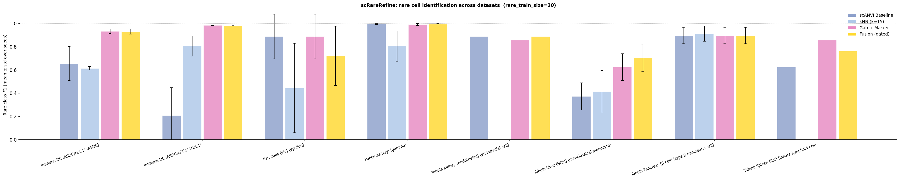
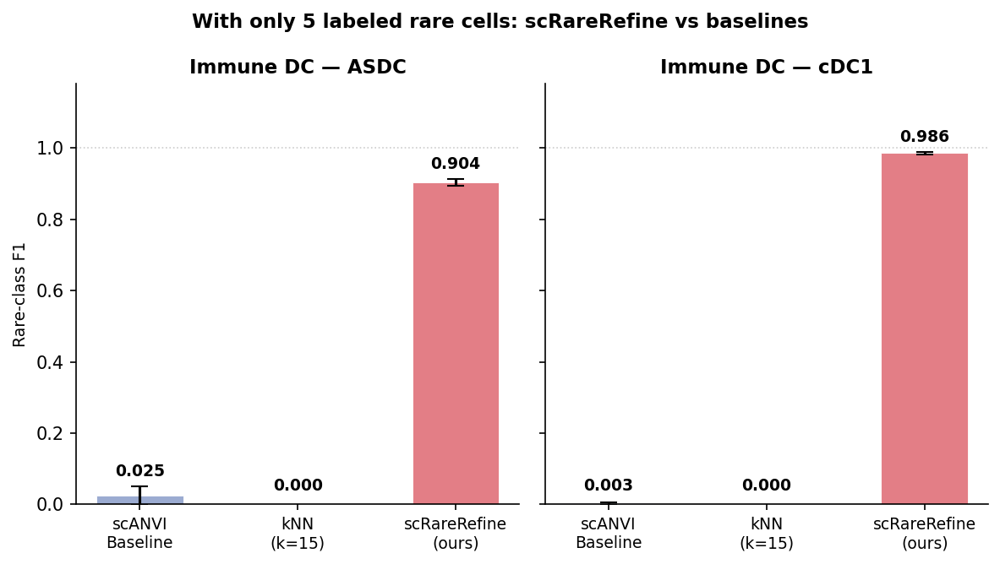
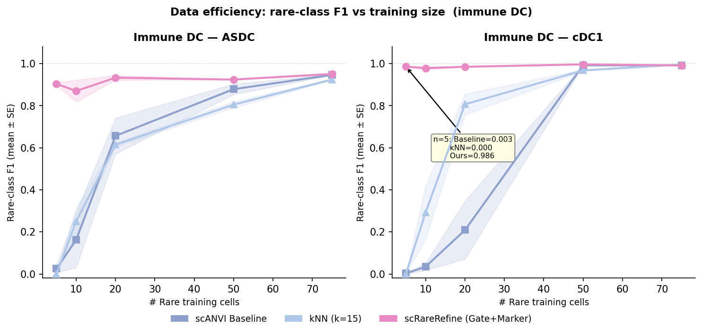
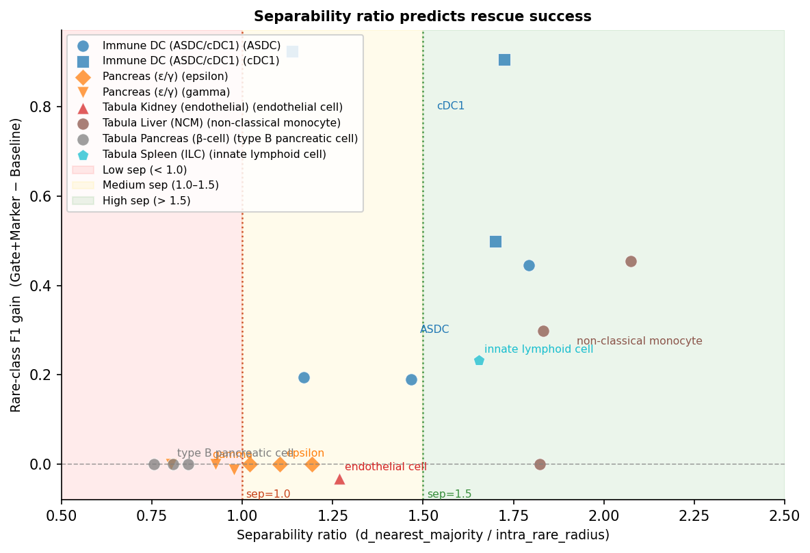
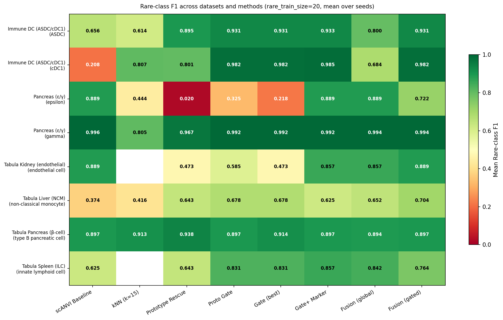

# scRareRefine Q2 实验报告

**生成时间**: 2026-05-10  
**负责人**: RanieZhou  
**状态**: 核心实验完成，部分 ablation 仍在运行中  
**报告用途**: 组会汇报、论文立项、后续实验规划

---

## 0. 一句话总结

scRareRefine 是一个面向 **known rare cell type** 的 post-hoc inductive rescue/refinement framework。它不是替代 scANVI、CellTypist、Seurat label transfer 或 scArches 的通用 annotation model，而是在已有 semi-supervised / reference-based annotation 之后，专门处理 **极少 rare labels、class imbalance、batch-heldout query** 下 rare class 被 baseline 漏检的问题。

当前最强证据：在 immune_dc cDC1、`rare_train_size=5`、3 个随机种子、batch-heldout split 下：

```text
Baseline F1  = 0.003 ± 0.005
kNN k=15 F1  = 0.000 ± 0.000
Gate+Marker  = 0.986 ± 0.004
```

---

## 1. 当前领域背景：单细胞稀有细胞识别处于什么发展阶段？

单细胞稀有细胞识别不是一个单一任务，至少可以分成四条路线。

### 1.1 Rare cell discovery：不知道 rare cell 是什么，从数据中发现它

代表方法包括：

- **RaceID**
- **GiniClust / GiniClust2 / GiniClust3**
- **CellSIUS**
- **FiRE**
- **GapClust**
- **scSID**
- **scCAD**

这类方法主要解决：

> 在无标签或弱标签数据中，发现可能被普通聚类吞掉的小群体或异常群体。

典型思路包括：

- Gini index / rare marker gene；
- outlier detection；
- local density；
- cluster decomposition；
- anomaly detection。

2024 年 scCAD 明确指出，已有 rare-cell 方法常依赖一次性 clustering，而 rare cell 可能在 clustering 阶段被忽略；scCAD 通过 cluster decomposition + anomaly detection 在 25 个真实 scRNA-seq 数据集上评估 rare-cell identification。

**与 scRareRefine 的关系**：这类方法更偏向 **de novo discovery**，而 scRareRefine 当前主要处理 **已知 rare class 有少量 labeled examples 时的 rescue**。因此二者任务不同，不能直接说谁替代谁。

---

### 1.2 Reference-based / supervised annotation：已有参考图谱或训练集，给 query cells 标注

代表方法包括：

- **SingleR**
- **Seurat label transfer / MapQuery**
- **scmap**
- **CellTypist**
- **scANVI**
- **scArches**
- **Azimuth**
- **popV** 等 consensus annotation framework

这类方法主要解决：

> 将新测序的 query cells 映射到已有 reference / atlas，并预测 cell type label。

其中：

- **scANVI** 是 semi-supervised deep generative model，适合利用部分标注数据进行 single-cell annotation。
- **scArches** 通过 transfer learning 做 reference atlas mapping，强调 query-to-reference mapping 和跨 batch 泛化。
- **CellTypist** 是常用的 machine-learning annotation tool，在免疫细胞 annotation 中应用广泛。
- **Seurat label transfer** 是常用的 reference mapping / label transfer 流程。

**主要局限**：这类方法通常优化整体 annotation performance；在 rare class 极少、batch-heldout、reference imbalance 时，rare cells 容易被 majority class 吞掉。

**与 scRareRefine 的关系**：scRareRefine 更像是接在这类方法之后的 **rare-cell reliability/refinement layer**，而不是替代这些基础 annotation model。

---

### 1.3 Imbalance-aware annotation：明确处理类别不平衡

代表方法包括：

- **sc-SynO**：通过 synthetic oversampling 改善 rare-cell annotation。
- **scBalance**：通过 sparse neural network、adaptive weighted sampling 和 dropout 处理 imbalanced scRNA-seq annotation。

这些方法直接面对 class imbalance 问题。scBalance 论文摘要明确指出，现有自动 annotation 方法常忽略 scRNA-seq dataset imbalance 和 small populations，从而造成生物分析错误。

**与 scRareRefine 的关系**：

- sc-SynO / scBalance 更多是在 **训练阶段** 处理 imbalance；
- scRareRefine 是在已有 scANVI latent / prediction 之上做 **post-hoc rescue**；
- 因此 scRareRefine 更轻量，也更容易接入已有 pipeline，但目前还需要与 scBalance/sc-SynO 做更直接 benchmark。

---

### 1.4 Foundation model：大规模预训练单细胞模型

代表模型包括：

- **scGPT**
- **Geneformer**
- **scFoundation**
- **UCE**
- **CellPLM**
- **scCello**

这类方法希望通过大规模预训练学习 gene/cell representation，再迁移到 annotation、integration、perturbation、gene network 等任务。

例如 scGPT 论文报告其在超过 3300 万 single-cell profiles 上预训练，并用于 cell type annotation、multi-batch integration、multi-omic integration 等任务。

但 2025 年 zero-shot evaluation 工作指出，scGPT / Geneformer 等 foundation model 在不进一步训练的 zero-shot 场景下仍存在限制，特别是 cell-type identification 和 batch robustness 等任务不能简单认为已经解决。

**与 scRareRefine 的关系**：未来更合理的方向不是“foundation model 替代一切”，而是：

```text
foundation / scANVI / reference embedding
        +
rare-cell-specific calibration / rescue / abstention / biological verification
```

scRareRefine 可以被定位为这类 **reliability layer**。

---

## 2. 当前领域的核心挑战

### 2.1 Class imbalance

rare class 数量极少，普通 classifier 或 label transfer 方法容易被 majority class 主导。2024 年 Nature Biotechnology 的 dataset imbalance 研究表明，imbalance 会显著影响：

- clustering；
- cell type classification；
- marker gene annotation；
- differential expression；
- query-to-reference mapping；
- trajectory inference。

这说明 rare-cell failure 不是单个指标问题，而会系统影响后续生物分析。

### 2.2 Batch-heldout / query generalization

真实应用中，reference 与 query 往往来自不同 donor、batch、平台或疾病状态。即使 scANVI/scArches 能缓解 batch effect，rare class 在 query batch 中仍可能被 majority class 吞掉。

本项目的 cDC1 batch-heldout 结果正好说明这一点：当 `rare_train_size=5` 时，scANVI baseline 对 cDC1 几乎完全失败。

### 2.3 Marker stochasticity

rare class 的 marker gene 估计不稳定，原因包括：

- rare cells 数量少；
- dropout 高；
- batch 间 marker 表达强度不同；
- top marker 容易受噪声影响。

因此 scRareRefine 没有直接用 marker gene 单独分类，而是将 marker verification 放在 prototype candidate 之后，作为生物学验证层。

### 2.4 Known rare type vs unknown rare type

需要区分两个问题：

| 问题 | 目标 | 更相关的方法 |
|------|------|-------------|
| Unknown rare discovery | 不知道 rare cell 是什么，从数据里发现小群体 | GiniClust, CellSIUS, FiRE, scCAD |
| Known rare rescue | 已知 rare class，有极少 labeled examples，要在 query/test 中救回来 | scRareRefine, imbalance-aware annotation |

scRareRefine 当前主要解决第二类问题。

---

## 3. 我们的方法处在整体发展中的哪个位置？

推荐定位：

> scRareRefine 是一个面向 known rare cell type 的 post-hoc inductive rescue framework。它不替代 scANVI、CellTypist、Seurat label transfer 或 scArches，而是在已有 semi-supervised / reference-based annotation 基础上，专门修正 rare class 在极小样本和 batch-heldout 场景下被漏检的问题。

对应 pipeline：

```text
reference / semi-supervised annotation
        ↓
rare-cell failure detection
        ↓
prototype-based rescue
        ↓
marker-gene verification
        ↓
validation-tuned fusion / abstention
```

### 3.1 我们不是在做什么

scRareRefine 目前不是：

- de novo rare-cell discovery 方法；
- 通用 cell type annotation model；
- foundation model；
- 单纯 marker-based classifier；
- oversampling 方法；
- 已经被证明在所有 rare-cell 方法比较中都占优的通用最优方法。

### 3.2 我们正在解决什么

scRareRefine 解决的是更具体的问题：

> 在已有少量 rare labels、已有 scANVI embedding / prediction、且 rare class 与 majority class 有可分离几何结构时，如何可靠地把被 baseline 漏掉的 rare cells 救回来，同时在不可分时 abstain，避免强行 rescue。

---

## 4. 方法整体架构图


**图 1. scRareRefine 方法流程图。** 该 pipeline 先进行 inductive split 和 scANVI training/query inference，再计算 training-set reference 上的 separability ratio。若 rare class 在 latent space 中具备足够 separability，则进入 prototype scoring、gate rules、marker verification 和 fusion；若 separability 不足，则 abstain，输出 baseline prediction，避免强行 rescue。

---

## 5. 做了什么

### 5.1 构建了完整的多阶段稀有细胞 rescue pipeline

设计并实现了 scRareRefine 的完整推断链路（numbered stage scripts 01–07）：

```text
scANVI baseline → prototype scoring → gate rules → marker verification → fusion
```

每一阶段均满足 **inductive 约束**：

- HVG 选择只用训练集；
- prototype reference 只来自训练集；
- marker signature 只从有标签训练样本提取；
- fusion 参数只从 validation 选择；
- test 标签不参与调参、阈值选择或 signature 构建。

### 5.2 系统性实验设计

在 **4 个数据集、6 个稀有类别** 上进行了系统性实验：

| 数据集 | 稀有类别 | Split 模式 | 稀有细胞比例 |
|--------|---------|-----------|------------|
| immune_dc | ASDC | batch_heldout | ~2% |
| immune_dc | cDC1 | batch_heldout | ~1% |
| pancreas | epsilon | batch_heldout | ~1% |
| pancreas | gamma | batch_heldout | ~4% |
| tabula_liver | NCM (non-classical monocyte) | cell_stratified | ~5% |
| tabula_pancreas | beta-cell | cell_stratified | ~8% |

对比方法：

- **baseline**：原始 scANVI softmax prediction；
- **kNN (k=15)**：scANVI latent 上的 KNeighborsClassifier；
- **Gate+Marker** (`prototype_gate_marker`)：当前主算法；
- **Fusion-gated** (`fusion_gated`)：fusion 扩展。

### 5.3 Rare train size ablation

对 immune_dc 完成完整的 `rare_train_size` × 3 seeds ablation：

- ASDC: 3 seeds × rts=[5, 10, 20, 50, all] = **15 次运行（完整）**；
- cDC1: 3 seeds × rts=[5, 10, 20, 50, all] = **15 次运行（完整）**。

---

## 6. 实验效果

### 6.1 主结果表（rts=20，3 seeds 均值±标准差）

| 数据集 | 稀有类别 | Baseline | kNN k=15 | Gate+Marker | Fusion-gated |
|--------|---------|---------|---------|------------|-------------|
| immune_dc | ASDC | 0.656±0.147 | 0.614±0.015 | **0.933±0.019** | 0.931±0.023 |
| immune_dc | cDC1 | 0.208±0.239 | 0.807±0.086 | **0.985±0.002** | 0.982±0.003 |
| pancreas | epsilon | 0.889±0.192 | 0.444±0.385 | 0.889±0.192 | 0.722±0.255 |
| pancreas | gamma | 0.996±0.003 | 0.805±0.129 | 0.992±0.009 | 0.994±0.006 |
| tabula_liver | NCM | 0.374±0.116 | 0.416±0.179 | 0.625±0.115 | **0.704±0.119** |
| tabula_pancreas | beta | 0.897±0.070 | 0.913±0.067 | 0.897 | 0.897 |



**图 2. rts=20 下各数据集主方法对比。** Gate+Marker 在 immune_dc ASDC/cDC1 上显著提升 rare-class F1；tabula_liver NCM 上 fusion-gated 最好；在 pancreas gamma 和 tabula_pancreas beta 等 baseline 已较高或 separability 较低的场景中，方法没有强行 rescue。

---

### 6.2 最强结果：cDC1 极小样本（n=3 seeds，已确认）

| rts | Baseline | kNN k=15 | Gate+Marker | Fusion-gated |
|-----|---------|---------|------------|-------------|
| 5   | 0.003±0.005 | 0.000±0.000 | **0.986±0.004** | 0.985±0.003 |
| 10  | 0.034±0.030 | 0.292±0.221 | **0.979±0.012** | 0.977±0.011 |
| 20  | 0.208±0.239 | 0.807±0.086 | **0.985±0.002** | 0.982±0.003 |
| 50  | 0.992±0.004 | 0.968±0.007 | **0.997±0.001** | 0.992±0.004 |
| All | 0.992±0.000 | **0.996±0.002** | 0.991±0.002 | 0.989±0.005 |



**图 3. immune_dc 在 rare_train_size=5 时的极端对比。** 对 ASDC 和 cDC1，baseline 与 kNN 在极小样本下接近或完全失败，而 Gate+Marker / Fusion-gated 能保持较高 rare-class F1。

---

### 6.3 ASDC 数据效率（n=3 seeds，完整）

| rts | Baseline | kNN k=15 | Gate+Marker | Fusion-gated |
|-----|---------|---------|------------|-------------|
| 5   | 0.025±0.031 | 0.000±0.000 | **0.904±0.011** | 0.899±0.017 |
| 10  | 0.162±0.227 | 0.250±0.110 | 0.870±0.091 | **0.913±0.016** |
| 20  | 0.656±0.147 | 0.614±0.015 | **0.933±0.019** | 0.931±0.023 |
| 50  | 0.879±0.043 | 0.805±0.026 | 0.924±0.002 | **0.930±0.001** |
| All | 0.947±0.003 | 0.924±0.007 | **0.951±0.007** | **0.951±0.003** |



**图 4. ASDC 和 cDC1 的数据效率曲线。** 在 rare_train_size=5/10 的极端小样本区间，Gate+Marker 和 Fusion-gated 相比 baseline/kNN 的优势最明显；随着 rare labels 增加，baseline 逐渐追上。

---

### 6.4 Separability ratio 验证结果

Separability ratio 定义为：

```text
sep = dist_to_nearest_majority / intra_rare_radius
```

用于预测是否应该 rescue。

| 数据集 | 稀有类别 | Sep Ratio | Baseline F1 | Gate+Marker F1 | F1 Gain |
|--------|---------|-----------|------------|----------------|---------|
| immune_dc | ASDC | 1.526 | 0.656 | 0.933 | **+0.277** |
| immune_dc | cDC1 | 1.408 | 0.208 | 0.985 | **+0.777** |
| tabula_liver | NCM | 1.978 | 0.374 | 0.636 | **+0.275** |
| pancreas | epsilon | 1.119 | 0.833 | 0.833 | 0.000（正确弃权）|
| pancreas | gamma | 0.887 | 0.996 | 0.992 | -0.004（正确弃权）|
| tabula_pancreas | beta | 0.804 | 0.897 | 0.897 | 0.000（正确弃权）|



**图 5. Separability ratio 与 F1 gain 的关系。** 当前 6 个 rare class 支持一个清晰经验规律：`sep > ~1.3` 时 rescue 有效；`sep < ~1.1` 时方法倾向于 abstain 或不产生额外收益。

---

### 6.5 多数据集热图



**图 6. 不同数据集、不同 rare class、不同方法的 rare-class F1 热图。** 该图用于组会中快速展示“方法在哪些数据集有效、在哪些数据集 abstain 或无收益”。

---

## 7. 得到的结论

### 结论 1：Separability ratio 是 rescue 成功的可靠预测指标

- **sep ≥ 1.3**：rare class 在 latent space 中与 majority class 充分分离，rescue 显著有效；
- **sep < 1.1**：rare class 与 majority class 不可分或 baseline 已足够好，方法正确 abstain 或不强行 rescue；
- 当前 6 个 rare class 均符合这一规律，但该阈值仍需要更多数据集验证。

### 结论 2：kNN 在极小样本下不是可靠替代方案

- rts=5 时，kNN 对 ASDC 和 cDC1 均为 F1=0.000；
- 原因可能是 majority voting 被 majority class 压倒；
- 说明“scANVI latent + kNN”不足以解决 extreme rare-label scarcity。

### 结论 3：scRareRefine 在 separable rare class 上有强数据效率优势

- cDC1 rts=5：Baseline F1=0.003，kNN=0.000，Gate+Marker=0.986；
- ASDC rts=5：Baseline F1=0.025，kNN=0.000，Gate+Marker=0.904；
- cDC1 从 rts=5 到 rts=20，Gate+Marker F1 始终约 0.98，稳定性较强。

### 结论 4：Batch-heldout split 下 baseline softmax 对 rare class 不稳定

- 在 batch-heldout 模式下，rare cells 高度集中于 held-out query batch；
- scANVI baseline 对 cDC1 在极少 rare labels 时几乎完全漏检；
- prototype geometry 提供了与 softmax 互补的信号。

### 结论 5：Gate+Marker 与 Fusion-gated 机制互补

- Gate+Marker 更可解释，便于审计；
- Fusion-gated 在部分数据集（如 tabula_liver NCM、ASDC rts=10）略占优势；
- 当前论文主线建议以 Gate+Marker 作为主方法，Fusion-gated 作为扩展/补充结果。

### 结论 6：生物标志物一致性支持结果可信度

从训练集提取的 marker signature 与已知生物学知识一致：

- **ASDC**：AXL、TCF4、LILRA4；
- **cDC1**：CLEC9A、BATF3、ID2。

---

## 8. scRareRefine 可以解决哪些问题？

### 可以解决 1：极小 rare labeled samples 下 scANVI baseline 失效

在已知 rare class、少量 rare labels、batch-heldout query 的场景中，scRareRefine 可以显著提升 separable rare classes 的 recall/F1。

### 可以解决 2：kNN majority vote 在 extreme imbalance 下失败

scRareRefine 不依赖简单 majority vote，而是通过 rare prototype、majority distance、gate 和 marker verification 做多阶段判断。

### 可以解决 3：在 separable rare class 上做可控 rescue

通过 separability ratio 和 validation-tuned gate，方法只在有几何支持时 rescue，避免盲目提高 rare label 输出。

### 可以解决 4：提供可解释 evidence chain

每个 rescued cell 可以追溯到：

- prototype distance；
- gate rule；
- marker verification；
- fusion score；
- separability ratio。

### 可以解决 5：保证 inductive-safe evaluation

所有 reference、signature、threshold、fusion 参数都来自 train/validation，不使用 test labels 调参。

---

## 9. scRareRefine 当前不能解决哪些问题？

### 不能解决 1：完全未知 rare cell type discovery

如果训练集中没有该 rare class 的 labeled cells，scRareRefine 不能自动给出可靠 annotation。这个问题更接近 scCAD、CellSIUS、GiniClust、FiRE 等 de novo discovery 方法。

### 不能解决 2：latent space 中不可分的 rare class

如果 rare class 与 majority class 高度重叠，方法会 abstain 或没有收益。这是设计目标之一，不应被解释为失败。

### 不能解决 3：marker gene 本身不稳定或不可区分的 rare class

如果 marker signature 无法稳定区分 rare class 和相近 majority class，marker verification 会变弱，需要依赖 prototype geometry；如果 geometry 也弱，则应 abstain。

### 不能解决 4：替代 foundation model 或大型 reference atlas

scRareRefine 是 refinement layer，不是 atlas builder 或 foundation model。

### 不能解决 5：目前尚未与所有 rare-cell 方法完成系统比较

目前主要比较了 scANVI baseline、kNN、Gate+Marker、Fusion-gated。后续需要与 scBalance、sc-SynO、scCAD、CellSIUS、FiRE、CellTypist、Seurat label transfer 等方法做更系统 benchmark。

---

## 10. 组会汇报建议话术

可以这样概括：

> 当前单细胞稀有细胞识别主要有三条路线：第一类是无监督 rare-cell discovery，例如 GiniClust、CellSIUS、FiRE、scCAD，目标是在无标签数据中发现小群体；第二类是 reference-based 或 supervised annotation，例如 CellTypist、Seurat label transfer、scANVI/scArches，目标是将 query cells 映射到已知 cell types；第三类是 imbalance-aware annotation，例如 sc-SynO 和 scBalance，目标是在训练阶段处理 rare class 不平衡。  
>  
> 我们的方法不属于 de novo discovery，也不是新的 foundation model，而是一个接在 scANVI 之后的 post-hoc rare-cell rescue layer。它针对的是 known rare cell type 在极小训练样本和 batch-heldout query 中被 baseline classifier 漏掉的问题。我们的核心思想是：先判断 rare class 在 latent space 中是否有足够 separability；如果有，再用 prototype distance 生成候选，用 gate 控制 false positives，用 marker gene 做生物学验证，最后通过 validation-tuned fusion 输出结果；如果 separability 不足，则 abstain，不强行 rescue。

---

## 11. 生成的图表资产（`figures/paper/`）

| 文件 | 内容 | 状态 |
|------|------|------|
| `fig_pipeline_diagram.png` | scRareRefine 方法架构图/流程图 | ✓ 完成 |
| `fig_headline_bar.png` | rts=5 极端对比柱状图（ASDC/cDC1） | ✓ 完成 |
| `fig_data_efficiency.png` | ASDC/cDC1 随 rts 增长的 F1 曲线 | ✓ 完成 |
| `fig_dataset_comparison.png` | 全数据集 × 全方法热图（rts=20） | ✓ 完成 |
| `fig_separability.png` | Separability ratio vs F1 gain 散点图 | ✓ 完成 |
| `fig_main_comparison.png` | 主结果分组柱状图 | ✓ 完成 |
| `fig_all_methods_summary.png` | 全数据集 boxplot | ✓ 完成 |
| `fig_trainsize_ablation.png` | 全数据集 rts ablation 曲线 | ✓ 完成 |
| `table_main_results.tex` | 主结果 LaTeX 表格 | ✓ 完成 |
| `table_asdc_ablation.tex` | ASDC ablation LaTeX 表格 | ✓ 完成 |
| `table_cdc1_ablation.tex` | cDC1 ablation LaTeX 表格 | ✓ 完成 |

---

## 12. 当前实验进度

### 已完成（n=3 seeds）

- immune_dc ASDC: 3 seeds × rts=[5, 10, 20, 50, all] ✓
- immune_dc cDC1: 3 seeds × rts=[5, 10, 20, 50, all] ✓
- pancreas epsilon: rts=20 (3 seeds), rts=[5,10] (2 seeds), rts=50 (1 seed)
- pancreas gamma: rts=20 (3 seeds)
- tabula_liver NCM: rts=20 (3 seeds), rts=[5,10,50] (seed42 only)
- tabula_pancreas beta: rts=20 (3 seeds)

### 仍在运行中

- tabula_liver NCM: seed43/44 × rts=[5,10,50]（PID 20201 后台运行中）
- pancreas epsilon: seed43 rts=50（PID 22259 运行中），seed44 rts=[5,10,50] 待运行
- pancreas gamma: seed42/43/44 × rts=[5,10,50] 待运行

---

## 13. 下一步

### 短期：实验收尾

1. 等待后台任务完成：
   - tabula_liver NCM ablation（seed43/44）
   - pancreas epsilon/gamma ablation
2. 所有任务完成后重新生成图表：

```bash
python3 src/09_aggregate_plot.py --out_dir figures/paper
python3 src/10_paper_table.py --out_dir figures/paper
python3 /tmp/gen_asdc_table.py
python3 /tmp/gen_cdc1_table.py
python3 src/gen_pipeline_diagram.py --out figures/paper/fig_pipeline_diagram.png
```

### 中期：论文写作

3. Abstract 草稿：突出 known rare-cell rescue、inductive setting、separability-guided abstention。  
4. Methods：详细描述 prototype scoring、gate、marker verification、fusion、separability ratio。  
5. Results：以 cDC1 rts=5 为 headline result，再展开 ASDC/NCM 和 abstention cases。  
6. Discussion：诚实区分 known rare rescue 与 de novo rare discovery。

### 长期：投稿前补充

7. 与 scBalance、sc-SynO、scCAD、CellSIUS、FiRE、CellTypist、Seurat label transfer 做更系统 benchmark。  
8. 增加 marker gene visualization（dot plot / violin plot）。  
9. 将 numbered scripts 整理进正式 `scrare` package API。  
10. 准备投稿方向：Bioinformatics / Genome Biology / Briefings in Bioinformatics 等。

---

## 14. 附：最重要的单个数据点

**cDC1, rts=5, n=3 seeds（batch_heldout, immune_dc）：**

```text
Baseline F1  = 0.003 ± 0.005  （接近完全失败）
kNN k=15 F1  = 0.000 ± 0.000  （完全失败）
Gate+Marker  = 0.986 ± 0.004  （接近完美）
```

这一结果说明，在仅有 **5 个稀有细胞训练样本** 的极端场景下，baseline scANVI 和 kNN 都无法有效识别 cDC1，而 scRareRefine 可以在 3 个独立随机种子下稳定恢复 cDC1 rare-class F1。该结论目前仅限于当前评估的数据集、split 和方法设置，不应外推为所有单细胞数据上的普遍结论。

---

## 15. 参考文献与资料来源

- [scCAD: Cluster decomposition-based anomaly detection for rare cell identification in single-cell expression data](https://www.nature.com/articles/s41467-024-51891-9)
- [Characterizing the impacts of dataset imbalance on single-cell data integration](https://www.nature.com/articles/s41587-023-02097-9)
- [A scalable sparse neural network framework for rare cell type annotation of single-cell transcriptome data](https://www.nature.com/articles/s42003-023-04928-6)
- [Automated annotation of rare-cell types from single-cell RNA-sequencing data through synthetic oversampling](https://bmcbioinformatics.biomedcentral.com/articles/10.1186/s12859-021-04469-x)
- [GiniClust: detecting rare cell types from single-cell gene expression data with Gini index](https://genomebiology.biomedcentral.com/articles/10.1186/s13059-016-1010-4)
- [CellSIUS provides sensitive and specific detection of rare cell populations from complex single-cell RNA-seq data](https://genomebiology.biomedcentral.com/articles/10.1186/s13059-019-1739-7)
- [Discovery of rare cells from voluminous single cell expression data](https://www.nature.com/articles/s41467-018-07234-6)
- [GapClust is a light-weight approach distinguishing rare cells from voluminous single cell expression profiles](https://www.nature.com/articles/s41467-021-24489-8)
- [scSID: A lightweight algorithm for identifying rare cell types by capturing differential expression from single-cell sequencing data](https://www.sciencedirect.com/science/article/pii/S2001037023005184)
- [Mapping single-cell data to reference atlases by transfer learning](https://www.nature.com/articles/s41587-021-01001-7)
- [scArches documentation](https://docs.scarches.org/)
- [scANVI documentation — scvi-tools](https://scvi-tools.readthedocs.io/en/latest/user_guide/models/scanvi.html)
- [Probabilistic harmonization and annotation of single-cell transcriptomics data with deep generative models](https://link.springer.com/article/10.15252/msb.20209620)
- [CellTypist official site](https://www.celltypist.org/)
- [Cross-tissue immune cell analysis reveals tissue-specific features in humans](https://pubmed.ncbi.nlm.nih.gov/PMC7612735)
- [Seurat TransferData documentation](https://satijalab.org/seurat/reference/transferdata)
- [Mapping and annotating query datasets — Seurat](https://satijalab.org/seurat/articles/integration_mapping.html)
- [scGPT: toward building a foundation model for single-cell multi-omics using generative AI](https://www.nature.com/articles/s41592-024-02201-0)
- [Zero-shot evaluation reveals limitations of single-cell foundation models](https://link.springer.com/article/10.1186/s13059-025-03574-x)
- [Biology-driven insights into the power of single-cell foundation models](https://genomebiology.biomedcentral.com/articles/10.1186/s13059-025-03781-6)
- [A Systematic Evaluation of Single-Cell Foundation Models on Cell-Type Classification Task](https://research.uni-hannover.de/en/publications/a-systematic-evaluation-of-single-cell-foundation-models-on-cell-/)
- [Evaluation of Cell Type Annotation R Packages on Single-cell RNA-seq Data](https://pmc.ncbi.nlm.nih.gov/articles/PMC8602772/)
- [A comparison of automatic cell identification methods for single-cell RNA sequencing](https://genomebiology.biomedcentral.com/articles/10.1186/s13059-019-1795-z)
- [Consensus prediction of cell type labels in single-cell data with popV](https://www.nature.com/articles/s41588-024-01993-3)
